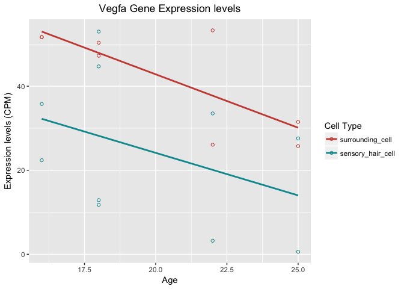
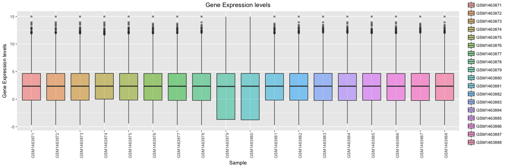
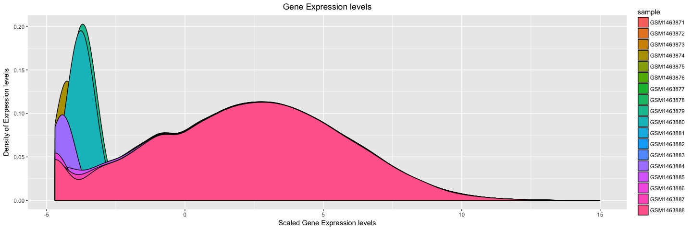
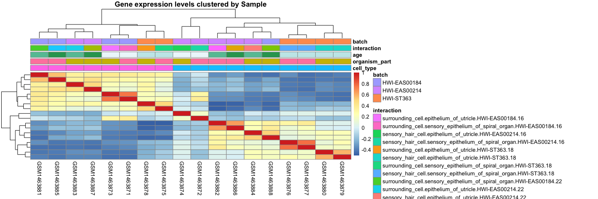
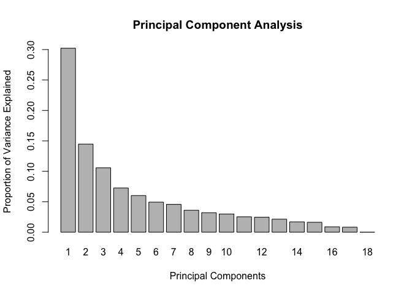
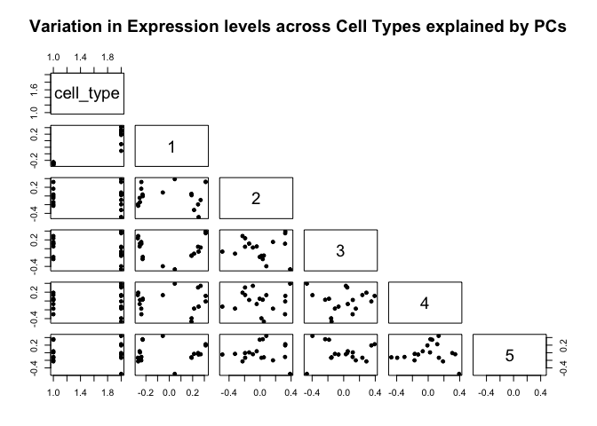
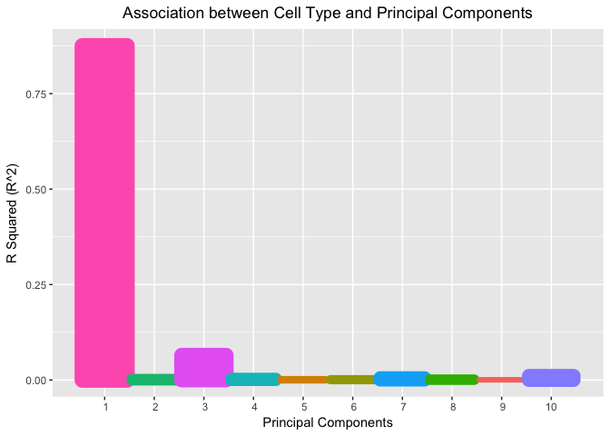
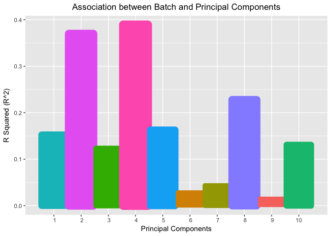

Assignment 1
================
Abdullah Farouk
2018-02-18

``` r
library(tidyverse)
library(ggplot2)
library(RColorBrewer)
library(cluster)
library(pvclust)
library(GEOquery)
library(knitr)
library(pheatmap)
library(pls)
```

Question 1: Data Inspection and Basic Manipulation
==================================================

``` r
exp_data <- readRDS(file = 'gse60019_expression_matrix.RDS')

exp_meta_data <- readRDS(file = 'gse60019_experiment_design.RDS')
#str(exp_data)
#str(exp_meta_data)

##How many genes are there?
length(exp_data$gene)
```

    ## [1] 14479

``` r
##How many samples are there?
length(exp_meta_data$sample)
```

    ## [1] 18

``` r
#How many factors are there? How may levels per factor? List them out.
#str(exp_meta_data[,2:5])
levels(exp_meta_data$organism_part) 
```

    ## [1] "epithelium_of_utricle"             
    ## [2] "sensory_epithelium_of_spiral_organ"

``` r
levels(exp_meta_data$cell_type) 
```

    ## [1] "surrounding_cell"  "sensory_hair_cell"

``` r
levels(exp_meta_data$time_point) 
```

    ## [1] "E16" "P0"  "P4"  "P7"

``` r
levels(exp_meta_data$batch)  
```

    ## [1] "HWI-EAS00184" "HWI-EAS00214" "HWI-ST363"

Q1.2 Data manipulation
======================

``` r
#Create a new column in the samples metadata tibble. Call it "age" and populate it with the appropriate numeric values. Hint: Assume that the mouse gestation length is 18 days (ie. P0 = 18).

exp_meta_data$age <- ifelse(exp_meta_data$time_point == "E16", 16, ifelse(exp_meta_data$time_point == "P0", 18, ifelse(exp_meta_data$time_point == "P4", 22, ifelse(exp_meta_data$time_point == "P7", 25, 99))))

#exp_meta_data <- exp_meta_data %>% 
  #arrange(order(time_point), sample)

#Find the expression profile for the gene Vegfa. Make a scatterplot with age on the x-axis and expression value in CPM on the y-axis. Color the data points by cell_type. Add in regression lines separately for each cell_type.

vegfa <- exp_data %>% filter(gene == 'Vegfa')

vegfa <- gather(vegfa, sample, CPM, factor_key = TRUE)

vegfa_1 <- left_join(vegfa,exp_meta_data, by = "sample")

vegfa_1 <- vegfa_1[-1,] #Removes row names created when using gather

vegfa_1$CPM <- as.numeric(vegfa_1$CPM)

{ggplot(vegfa_1, aes(x = age, y = CPM, color = cell_type))  +
    geom_point(shape=1) +
    scale_colour_hue(l=50) + # Use a slightly darker palette than normal
    geom_smooth(method=lm, se = FALSE) +
    ggtitle("Vegfa Gene Expression levels") +
    labs(x = 'Age', y = 'Expression levels (CPM)', color = 'Cell Type') +
    theme(plot.title = element_text(hjust = 0.5))}   # Don't add shaded confidence region
```



There is no indication of an interaction effect as both lines have smiliar slopes.

Question 2
==========

``` r
#The expression values are currently in CPM. Log2 transform them so that the distribution is more evenly spread out and can be examined more easily.

exp_data_log <- log2(exp_data[,2:19])
exp_data_log <- cbind(exp_data$gene, exp_data_log) #add gene names
colnames(exp_data_log) [1] <- 'gene' #Set column 1 name to gene

#Examine the distribution of gene expressions across all samples using 1. box plots and 2. overlapping density plots.
exp_data_log_1 <- gather(exp_data_log, sample, expression, 2:19)

#For the box plots, samples should be on the x-axis and expression should be on the y-axis.
{ggplot(exp_data_log_1, aes(x = sample, y = expression, fill = sample)) + geom_boxplot(alpha = 0.5) + theme(axis.text.x = element_text(angle = 90, hjust = 1)) + ggtitle('Gene Expression levels') + labs(x = 'Sample', y = 'Gene Expression levels') + theme(plot.title = element_text(hjust = 0.5))}
```



``` r
#For the overlapping density plots, expression should be on the x-axis and density should be on the y-axis. Lines should be colored by sample (i.e. one line per sample).

{ggplot(exp_data_log_1, aes(x = expression, fill = sample)) + geom_density(alpha = 1) + labs(x = 'Scaled Gene Expression levels', y = 'Density of Exrpession levels') + ggtitle('Gene Expression levels') + theme(plot.title = element_text(hjust = 0.5))}
```



Samples GSM1463879 and GSM1463880 stand out the most. They have the largest IQR as seen in the box plots and their densities have the highest peak (as seen in the density plots) compared to the rest.

``` r
#Examine the correlation between samples using one or more heatmaps. Again, use the log2 transformed expression values. Display cell_type, organism_part, age, and batch for each sample in the heatmap. Hint: Consider using pheatmap() with annotations.

exp_data_log_2 <- exp_data_log[, 2:19]

exp_data_log2_scaled <- t(scale(t(exp_data_log_2))) # Scaled so rows have mean 0 and unit variance

exp_data_log_2_corr <- cor(exp_data_log2_scaled) #Create correlation matrix of samples

exp_meta_data$interaction <- with(exp_meta_data, interaction(cell_type, organism_part, batch, age))

annotation_1 <- as.data.frame(exp_meta_data[, c('cell_type', 'organism_part', 'age', 'interaction', 'batch')]) # Set up matrix to annotate clusters

rownames(annotation_1) <- colnames(exp_data[,2:19]) 
#Ensures rows are named by sample

#Heatmap to see sample correlations
pheatmap(exp_data_log_2_corr, cluster_rows = TRUE, cluster_cols = TRUE, scale = "none", clustering_method = 'complete', clustering_distance_cols = "euclidean", main = 'Gene expression levels clustered by Sample', show_colnames = T, show_rownames = FALSE, annotation = annotation_1)
```



The sample is GSM1463874

Question 3
----------

``` r
#Perform PCA. Hint: Use svd() and remember to scale and center the expression data for all genes by using scale() and t().
sv <- svd(exp_data_log2_scaled)

rownames(sv$v) <- colnames(exp_data[,2:19])

barplot((sv$d^2)/sum(sv$d^2), names.arg = c(seq(1:18)), xlab = 'Principal Components', ylab = 'Proportion of Variance Explained', main = 'Principal Component Analysis')
```



``` r
#Which PCs seem to be associated with the cell_type variable? Hint: Explore using scatterplots.

exp_meta_data_pc <- cbind(exp_meta_data, sv$v[exp_meta_data$sample, 1:10])

# scatter plot showing us how the first few PCs relate to covariates
plot(exp_meta_data_pc[, c("cell_type", "1", "2", "3", "4", "5")], pch = 19, cex = 0.8, upper.panel = NULL, main = 'Variation in Expression levels across Cell Types explained by PCs')
```



``` r
#Quantitatively assess the association of the cell_type variable with all PCs up to PC10. Hint: Fit a linear model and look at the coefficient of determination (R-Squared); make a bar graph where x is PCs and y is R-Squared.

r_squared <- c()

for(i in 1:10) {
  pc_cell_relat <- lm(paste0("`",i,"`"," ~ cell_type"), data = exp_meta_data_pc)
  r_squared[i] <- c(summary(pc_cell_relat)$r.squared)
}

r_squared <- as.data.frame(r_squared) #To use ggplot on it

r_squared$index <- seq(1,10)

{ggplot(r_squared, aes(x = index, y = r_squared, fill = as.factor(r_squared), color = as.factor(r_squared), size = as.factor(r_squared)))  + geom_bar(stat = 'identity') + guides(fill = FALSE, size = FALSE, color = FALSE)+ labs(y = 'R Squared (R^2)') + ggtitle('Association between Cell Type and Principal Components') + theme(plot.title = element_text(hjust = 0.5)) + scale_x_discrete(name ="Principal Components", limits=c(seq(1:10)))}
```



``` r
#Quantitatively assess the association of the batch variable with all PCs up to PC10. Hint: Fit a linear model and look at the coefficient of determination (R-Squared); make a bar graph where x is PCs and y is R-Squared.

r_squared_1 <- c()

for(i in 1:10) {
  pc_cell_relat_1 <- lm(paste0("`",i,"`"," ~ batch"), data = exp_meta_data_pc)
  r_squared_1[i] <- c(summary(pc_cell_relat_1)$r.squared)
}

r_squared_1 <- as.data.frame(r_squared_1) #To use ggplot on it

r_squared_1$index <- seq(1,10)

{ggplot(r_squared_1, aes(x = index, y = r_squared_1, fill = as.factor(r_squared_1), color = as.factor(r_squared_1), size = as.factor(r_squared_1)))  + geom_bar(stat = 'identity') + guides(fill = FALSE, size = FALSE, color = FALSE) + labs(y = 'R Squared (R^2)') + ggtitle('Association between Batch and Principal Components') + theme(plot.title = element_text(hjust = 0.5)) + scale_x_discrete(name ="Principal Components", limits=c(seq(1:10)))}
```



R squared is a measure of the variation observed in the batch effect variable explained by the different principal components. 37% of its variation is captured by PC2, whilst only 15% of it is captured by PC1. PC2 seems to explain almost 3 times as much of the variance in the data due to batch effects compared to PC1.
