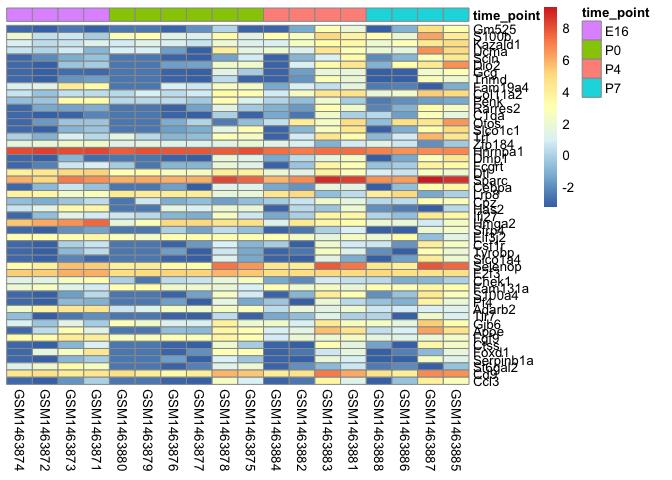
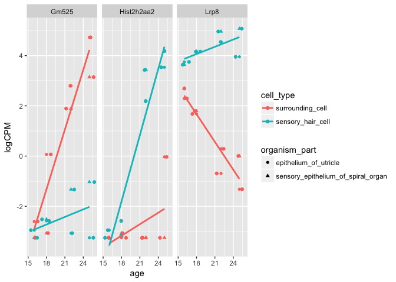

Assignment\_2
================
Abdullah Farouk
2018-03-22

Load libraries

``` r
library(limma)
library(tidyverse)
library(ggplot2)
library(dplyr)
library(reshape2)
library(pheatmap)
```

Read data in

``` r
exp_data <- readRDS(file = 'gse60019_expression_matrix.RDS')

exp_meta_data <- readRDS(file = 'gse60019_experiment_design.RDS')

exp_meta_data$age <- ifelse(exp_meta_data$time_point == "E16", 16, ifelse(exp_meta_data$time_point == "P0", 18, ifelse(exp_meta_data$time_point == "P4", 22, ifelse(exp_meta_data$time_point == "P7", 25, 99))))
```

Question 4
==========

### Remove lowly expressed genes by retaining genes that have CPM &gt; 1 in at least as many samples as the smallest group size (i.e use table() to identify the number of samples belonging to each treatment group. The smallest group size is the smallest number in that table).

``` r
finding_smallest_sample_num <- table(exp_meta_data$cell_type, exp_meta_data$organism_part)
smallest_group_size <- min(finding_smallest_sample_num)

exp_data_filtered <- exp_data[rowSums(exp_data %>% dplyr::select(-gene) >1) >= smallest_group_size, ]
```

How many genes are there after filtering?

``` r
nrow(exp_data_filtered)
```

    ## [1] 12761

### Use limma-voom to fit a linear model with cell type, organism part, age and the interaction between age and cell type as covariates (hint: use lmFit, voom and eBayes). Before you do this, reformat the data frame so that gene IDs are row names, and not a column (limma requires the dataset in this format).

``` r
#Converting exp data into desired form for lm fit. Transform the data frame into the format that matches the sample metadata

exp_data_lm <- exp_data_filtered %>% 
  as.data.frame() %>% 
  column_to_rownames("gene")
  
#Sanity check
(exp_meta_data$sample == colnames(exp_data_filtered%>% dplyr::select(-gene))) %>% all()
```

    ## [1] TRUE

``` r
#Create explanatory variables matrix
covariates <- model.matrix(~cell_type + organism_part + age + age:cell_type, data = exp_meta_data)

#Use voom to obtain logCPM values
exp_data_voom <- voom(exp_data_lm, covariates)

#Fit model using lm fit
fit <- lmFit(exp_data_voom, covariates) 

#Fit model using ebayes
fiteb <- eBayes(fit)
```

### For the gene Eva1a, what is the numeric value of the coeffcient of the age term? What does it mean?

``` r
signif(topTable(fiteb, 10, coef=2, sort.by = "p") ,3)
```

    ##             logFC AveExpr     t  P.Value adj.P.Val     B
    ## Gm525       11.90   0.773  6.45 3.64e-06    0.0458 2.570
    ## Cadm1        8.56  10.500  5.96 1.01e-05    0.0458 3.030
    ## Hist2h2aa2 -12.90   0.741 -5.93 1.08e-05    0.0458 1.950
    ## Bnc2       -11.80   1.840 -5.74 1.62e-05    0.0507 1.670
    ## Penk       -11.30   1.440 -5.52 2.58e-05    0.0507 1.360
    ## Epha5       11.90   3.490  5.50 2.70e-05    0.0507 1.410
    ## Gcnt4      -12.60   1.260 -5.49 2.78e-05    0.0507 1.160
    ## Cgn         -7.51   3.580 -5.20 5.30e-05    0.0671 0.938
    ## Herc6        8.89   1.600  5.18 5.49e-05    0.0671 0.721
    ## Atoh1       13.00   3.280  5.14 5.95e-05    0.0671 0.990

``` r
topGenes <- topTable(fiteb, number = Inf)
```

    ## Removing intercept from test coefficients

``` r
topGenes['Eva1a', 3] 
```

    ## [1] -0.1634874

### For the gene Eva1a, what is the numeric value of the coeffcient of the age term? What does it mean?

A one unit increase in age leads to a reduction in log (in base 2) CPM values of Eva1a gene by -0.1634874.

### Write down an equation describing the linear model you specified in 4.2. Hint: your equation should have a term for each column of the design matrix.

*Y*<sub>gene</sub> = **I** + *β*<sub>0gene</sub>**C** + *β*<sub>1gene</sub>**O** + *β*<sub>2gene</sub>**A** + *β*<sub>3gene</sub>**C****x****A** + *ϵ*<sub>gene</sub>

The terms in the equation above represent the model fit for every gene in our dataset. They are defined as follows:

**Y**<sub>gene</sub> represents the vector of expression levels across 18 samples for each gene.

**I** is the intercept vector

**O** is a binary vector indicating organism part of each sample for a particular gene

**C** is a binary vector that indicates cell type of each sample for a particular gene

**A** is a numeric vector which indicates age of the mouse from which the sample was taken for a particular gene. It has 4 distinct values (16, 18, 22 & 25)

**C****x****A** is a vector that represents the interaction between age and cell type.

**ϵ**<sub>gene</sub> is a vector of residuals for a particular gene.

### When you create a linear model, what is the underlying assumptions you are making about the distribution of the data (this question is multiple choice)?

The residuals of the fitted model are normally distributed

Question 5
==========

### Using the linear model defined above, determine the number of genes differentially expressed by cell type at an FDR (use adjust.method = "fdr" in topTable()) less than 0.05.

``` r
cell_type <- topTable(fiteb, coef = 'cell_typesensory_hair_cell', number = Inf, adjust.method = "fdr", p.value = 0.05)

nrow(cell_type) #number of genes
```

    ## [1] 3

### Although an FDR cutoff of 0.05 was used, many of the identified genes have smaller FDRs. By taking an average of the FDR across the set of differentially expressed genes, determine the number of genes that we expect to be false discoveries on average.

``` r
nrow(cell_type)*mean(cell_type$adj.P.Val)
```

    ## [1] 0.1373196

### Use decideTests() to quantify the number of genes that increase, decrease or don't change by cell type, organism part and age.

``` r
cutoff <- c(0.05, 0.005, 1e-04)

w <- lapply(cutoff, function(x){decideTests(fiteb, p.value = x, method = "global")})

for (i in 1 : length(w)) {
  print(summary(w[[i]]))
}
```

    ##        (Intercept) cell_typesensory_hair_cell
    ## Down            62                         83
    ## NotSig        7898                      12585
    ## Up            4801                         93
    ##        organism_partsensory_epithelium_of_spiral_organ   age
    ## Down                                               321   297
    ## NotSig                                           12165 12090
    ## Up                                                 275   374
    ##        cell_typesensory_hair_cell:age
    ## Down                              187
    ## NotSig                          12377
    ## Up                                197
    ##        (Intercept) cell_typesensory_hair_cell
    ## Down            19                         10
    ## NotSig        9733                      12734
    ## Up            3009                         17
    ##        organism_partsensory_epithelium_of_spiral_organ   age
    ## Down                                                77    57
    ## NotSig                                           12620 12592
    ## Up                                                  64   112
    ##        cell_typesensory_hair_cell:age
    ## Down                               28
    ## NotSig                          12714
    ## Up                                 19
    ##        (Intercept) cell_typesensory_hair_cell
    ## Down             2                          0
    ## NotSig       11557                      12761
    ## Up            1202                          0
    ##        organism_partsensory_epithelium_of_spiral_organ   age
    ## Down                                                 9     6
    ## NotSig                                           12740 12737
    ## Up                                                  12    18
    ##        cell_typesensory_hair_cell:age
    ## Down                                1
    ## NotSig                          12758
    ## Up                                  2

### Which variable is associated with the largest number of differentially expressed genes?

Age is associated with the largest number of differentially expressed genes (ie it has the highest the sum of the rows labelled up and down for different cutoff p values tested).

### Take the top 50 genes differentially expressed by age and create a heatmap of their expression levels in logCPM. Sort the genes by p-values and group the samples by time point.

``` r
gene_diff_exp <- topTable(fiteb, coef = "age", n = 50)

annotations <- as.data.frame(arrange(exp_meta_data, time_point)[,'time_point'])

rownames(annotations) <- arrange(exp_meta_data, time_point) %>% 
  select(sample) %>% 
  unlist(use.names = FALSE)

exp_log_data_grouped <- log(exp_data_lm[rownames(gene_diff_exp), arrange(exp_meta_data, time_point)$sample])  %>% as.matrix()

pheatmap(exp_log_data_grouped, cluster_cols = F, cluster_rows = F, annotation = annotations)
```



### Explain what you are modeling with this interaction term. For a particular gene, what does a signifcant interaction term mean?

For a particular gene, the **C****x****A** term models the simultaneous influence of cell type and age on logCPM values expressed. The presence of a significant interaction indicates that, for a particular gene, the effect of age on logCPM values is different for different cell types.

### For how many probes is the interaction effect significant (FDR less than 0.05)?

``` r
interaction_effect <- topTable(fiteb, coef = 5, number = Inf, adjust.method = "fdr", p.value = 0.05)
nrow(interaction_effect) #37 probes/genes
```

    ## [1] 37

### Plot the top three genes with the most significant interaction term. Make a scatterplot with log CPM on the y-axis and age on the x-axis. The shape of each point should correspond to the organism part, and the cell type should correspond to the colour. Note: some conditions have multiple samples, so it is best to plot the mean expression of each treatment group.

``` r
three_genes <- exp_data_lm[rownames(topTable(fiteb, coef = 5, number = 3, adjust.method = "fdr", p.value = 0.05)),]

#Convert expression into log CPM values
three_genes_log <- log(three_genes)

#Merge with meta data
three_genes_meta_data <- t(three_genes_log) %>% 
  as.data.frame() %>% 
  rownames_to_column('sample') %>% 
  gather(gene, values, -sample) %>% 
  as_tibble %>% 
  select(sample, gene = gene, logCPM = values) %>% 
  left_join(exp_meta_data, id = "sample") 
```

    ## Joining, by = "sample"

``` r
top_three_interaction_complete <- three_genes_meta_data %>% 
  group_by(gene, organism_part, cell_type, age) %>% 
  summarise(logCPM = mean(logCPM))
```

``` r
top_three_interaction_complete %>% 
  ggplot(aes(x = age, y = logCPM, color = cell_type)) +
  geom_point(aes(shape = organism_part)) +
  geom_jitter() + 
  geom_smooth(method = "lm", se = FALSE) +
  facet_wrap(~gene)
```



Bonus Question
==============

Compare your results to those obtained by Scheffer et al (2015). Discuss any discrepancies. List at least three explanations for these discrepancies.
-----------------------------------------------------------------------------------------------------------------------------------------------------

-   We observe far fewer genes differentially expressed compared with the authors findings. Some reasons for this are:
-   The authors identified significantly differentially expressed genes by ranking them based on fold over changes. We did not. We used pvalues to do so instead.
-   One reason for this is that they worked with raw count data whilst we worked on CPM data (ie counts per million).
-   Additionally rather than using limma to identify these differentially expressed genes, they used DESeq, which may have produced a different output.

-   In addition, for every gene in our dataset, we tested for interactions between age and cell type. The authors could not have as they ranked gene enrichment in a particular cell type by avergaging across age and organ.
