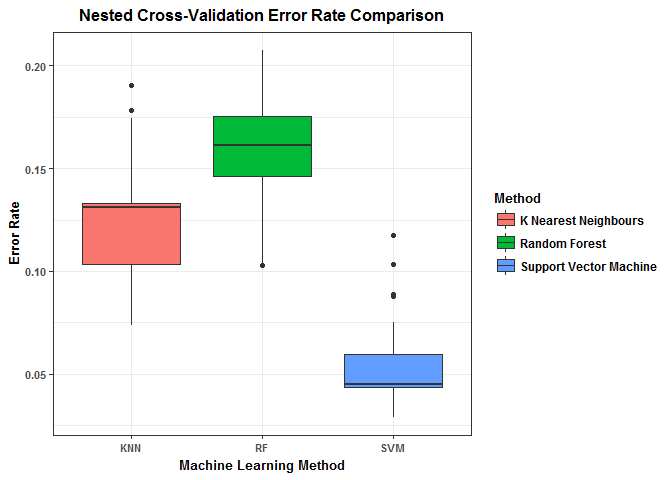
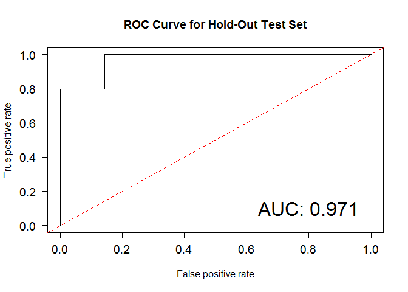

Disease Classification
================
Abdullah Farouk
2018-03-31

Machine Learning Approaches to Predict Disease Class
====================================================

Load Libraries
--------------

``` r
library(e1071)
library(kernlab)
library(caret)
library(class)
library(tidyverse)
library(dplyr)
library(ggplot2)
library(randomForest)
library(CMA)
library(ROCR)
```

Loading Datasets
----------------

We first load the list of CGIs chosen from feature selection, the CGI M values dataset, and the corresponding metadata. Then we subdivide the dataset into the training set and the test set (the same subdivision performed during feature selection in the "exploratory\_and\_limma\_analyses.md" script). Then finally, we subset the training and test datasets to only contain the feature selection CGIs.

``` r
CGI_Feat_Selection_Loc = paste(substr(getwd(), 1, nchar(getwd())-4),"Data/CGI_SL_Set.rdata", sep="")
CGI_Data_Loc = paste(substr(getwd(), 1, nchar(getwd())-4),"Data/M_CGI_data.RDS", sep="")
Meta_Data_Loc = paste(substr(getwd(), 1, nchar(getwd())-4),"Data/meta_data.csv", sep="")

#Load "CGI_Sel_Set_Final" object containing CGIs selected by CV from limma
load(CGI_Feat_Selection_Loc)
#Load M values
mV_CGI = readRDS(CGI_Data_Loc)
#Load meta data
Meta_data = read.csv(Meta_Data_Loc, header=TRUE, stringsAsFactors = TRUE, row.names=1)

set.seed(25)
#Remove 20% of our samples to be the test set
Test_Set_Index = sample(1:85, 17)

mV_CGI_Train = mV_CGI[-Test_Set_Index]
mV_CGI_Test = mV_CGI[Test_Set_Index]
Meta_data_Train = Meta_data[-Test_Set_Index,]
Meta_data_Test = Meta_data[Test_Set_Index,]

mV_CGI_trans = as.data.frame(t(mV_CGI_Train))
mV_CGI_test_t = as.data.frame(t(mV_CGI_Test))

mV_CGI_trans = mV_CGI_trans[CGI_Sel_Set_Final]
mV_CGI_test_F = mV_CGI_test_t[CGI_Sel_Set_Final]

mV_CGI_trans_F = cbind(Disease_Class=Meta_data_Train$Disease_Class, mV_CGI_trans)
mV_CGI_test_F = cbind(Disease_Class=Meta_data_Test$Disease_Class, mV_CGI_test_F)

#Check the rownames align with each other
sum(rownames(mV_CGI_trans_F) == Meta_data_Train$Sample) == 68
```

    ## [1] TRUE

``` r
sum(rownames(mV_CGI_test_F) == Meta_data_Test$Sample) == 17
```

    ## [1] TRUE

Nested CV for Random Forest
---------------------------

We first wanted to compare approaches to select the best approach for modelling the data and to successfully predict Disease Class. To do so, we performed nested cross-validation (CV) for each approach. Thus, we can simultaneously tune parameters and avoid overfitting so that all three approaches have comparable errors (after ensuring the folds are the same). We have 3-fold outer CV and 5-fold inner CV, where the inner CV selects the optimal parameter, and the outer CV computes the error of that model on the splits. This was done over 50 repetitions to obtain the final mean nested CV error. In this section, the approach applied was random forest, with a fixed 1001 decision trees and "mtry" (the number of variables to randomly sample) tuned across several values.

``` r
set.seed(80)
FoldInner = 5
FoldOuter = 3
Repeats = 50

NestedCV_Errors_RF = rep(NA, Repeats)

for(i in 1:Repeats){
  print(i)
  
  CurrSplits = GenerateLearningsets(y = mV_CGI_trans_F$Disease_Class, method="CV", fold=FoldOuter, strat= TRUE)
  
  Outer_Fold_Errors = rep(NA, FoldOuter)
  
  for(j in 1:FoldOuter){
    #Set the current training split
    Train_Index = CurrSplits@learnmatrix[j,]
    
    #Make training and validation sets
    Curr_Outer_Train = mV_CGI_trans_F[Train_Index,]
    Curr_Outer_Test = mV_CGI_trans_F[-Train_Index,]
    
    #Inner CV on the given training set
    cv_inner = trainControl(method="cv", number=FoldInner, classProbs=FALSE)
    RF_inner_cv = train(Disease_Class~., data=Curr_Outer_Train, ntree=1001, method="rf",
                        metric="Accuracy", trControl=cv_inner, trace=FALSE,
                        tuneGrid=data.frame(mtry=c(4,8,12,16,20)))
    #Find the hyperparameters that achieve the highest accuracy
    Potent_Params = which(RF_inner_cv$results$Accuracy == max(RF_inner_cv$results$Accuracy))
    #Obtain the optimal parameter from the inner CV (if mtry=12 is among the maximum accuracy
    # choices, select it by default)
    if(3 %in% Potent_Params){
      OptimParam = 12
    }else{
      OptimParam = as.numeric(RF_inner_cv$bestTune)
    }
    print(paste("mtry:",OptimParam,sep=""))
    
    #Random forest model with optimal parameter, and the outer splits
    RF_Outer = randomForest(x=Curr_Outer_Train[-1], y=Curr_Outer_Train[,1], xtest = Curr_Outer_Test[-1], ytest=Curr_Outer_Test[,1], mtry=OptimParam, ntree=1001)
    
    #Error on outer validation set
    Outer_Fold_Error = RF_Outer$test$err.rate[1001,1]
    Outer_Fold_Errors[j] = Outer_Fold_Error
  }
  
  NestedCV_Errors_RF[i] = mean(Outer_Fold_Errors)
}
```

    ## [1] 1
    ## [1] "mtry:12"
    ## [1] "mtry:16"
    ## [1] "mtry:12"
    ## [1] 2
    ## [1] "mtry:4"
    ## [1] "mtry:4"
    ## [1] "mtry:12"
    ## [1] 3
    ## [1] "mtry:12"
    ## [1] "mtry:12"
    ## [1] "mtry:8"
    ## [1] 4
    ## [1] "mtry:4"
    ## [1] "mtry:4"
    ## [1] "mtry:4"
    ## [1] 5
    ## [1] "mtry:4"
    ## [1] "mtry:12"
    ## [1] "mtry:4"
    ## [1] 6
    ## [1] "mtry:4"
    ## [1] "mtry:4"
    ## [1] "mtry:16"
    ## [1] 7
    ## [1] "mtry:4"
    ## [1] "mtry:4"
    ## [1] "mtry:16"
    ## [1] 8
    ## [1] "mtry:16"
    ## [1] "mtry:20"
    ## [1] "mtry:12"
    ## [1] 9
    ## [1] "mtry:4"
    ## [1] "mtry:16"
    ## [1] "mtry:4"
    ## [1] 10
    ## [1] "mtry:12"
    ## [1] "mtry:12"
    ## [1] "mtry:12"
    ## [1] 11
    ## [1] "mtry:4"
    ## [1] "mtry:12"
    ## [1] "mtry:12"
    ## [1] 12
    ## [1] "mtry:12"
    ## [1] "mtry:4"
    ## [1] "mtry:4"
    ## [1] 13
    ## [1] "mtry:20"
    ## [1] "mtry:4"
    ## [1] "mtry:12"
    ## [1] 14
    ## [1] "mtry:12"
    ## [1] "mtry:20"
    ## [1] "mtry:4"
    ## [1] 15
    ## [1] "mtry:4"
    ## [1] "mtry:4"
    ## [1] "mtry:12"
    ## [1] 16
    ## [1] "mtry:8"
    ## [1] "mtry:8"
    ## [1] "mtry:4"
    ## [1] 17
    ## [1] "mtry:4"
    ## [1] "mtry:16"
    ## [1] "mtry:4"
    ## [1] 18
    ## [1] "mtry:4"
    ## [1] "mtry:12"
    ## [1] "mtry:4"
    ## [1] 19
    ## [1] "mtry:4"
    ## [1] "mtry:4"
    ## [1] "mtry:12"
    ## [1] 20
    ## [1] "mtry:16"
    ## [1] "mtry:4"
    ## [1] "mtry:12"
    ## [1] 21
    ## [1] "mtry:20"
    ## [1] "mtry:4"
    ## [1] "mtry:4"
    ## [1] 22
    ## [1] "mtry:8"
    ## [1] "mtry:4"
    ## [1] "mtry:4"
    ## [1] 23
    ## [1] "mtry:12"
    ## [1] "mtry:12"
    ## [1] "mtry:12"
    ## [1] 24
    ## [1] "mtry:16"
    ## [1] "mtry:8"
    ## [1] "mtry:4"
    ## [1] 25
    ## [1] "mtry:4"
    ## [1] "mtry:4"
    ## [1] "mtry:20"
    ## [1] 26
    ## [1] "mtry:12"
    ## [1] "mtry:4"
    ## [1] "mtry:4"
    ## [1] 27
    ## [1] "mtry:4"
    ## [1] "mtry:4"
    ## [1] "mtry:12"
    ## [1] 28
    ## [1] "mtry:4"
    ## [1] "mtry:4"
    ## [1] "mtry:12"
    ## [1] 29
    ## [1] "mtry:20"
    ## [1] "mtry:12"
    ## [1] "mtry:4"
    ## [1] 30
    ## [1] "mtry:12"
    ## [1] "mtry:20"
    ## [1] "mtry:12"
    ## [1] 31
    ## [1] "mtry:16"
    ## [1] "mtry:4"
    ## [1] "mtry:20"
    ## [1] 32
    ## [1] "mtry:8"
    ## [1] "mtry:4"
    ## [1] "mtry:4"
    ## [1] 33
    ## [1] "mtry:16"
    ## [1] "mtry:16"
    ## [1] "mtry:4"
    ## [1] 34
    ## [1] "mtry:16"
    ## [1] "mtry:12"
    ## [1] "mtry:4"
    ## [1] 35
    ## [1] "mtry:12"
    ## [1] "mtry:20"
    ## [1] "mtry:12"
    ## [1] 36
    ## [1] "mtry:4"
    ## [1] "mtry:12"
    ## [1] "mtry:16"
    ## [1] 37
    ## [1] "mtry:12"
    ## [1] "mtry:12"
    ## [1] "mtry:4"
    ## [1] 38
    ## [1] "mtry:4"
    ## [1] "mtry:4"
    ## [1] "mtry:16"
    ## [1] 39
    ## [1] "mtry:12"
    ## [1] "mtry:4"
    ## [1] "mtry:4"
    ## [1] 40
    ## [1] "mtry:16"
    ## [1] "mtry:8"
    ## [1] "mtry:12"
    ## [1] 41
    ## [1] "mtry:4"
    ## [1] "mtry:8"
    ## [1] "mtry:12"
    ## [1] 42
    ## [1] "mtry:4"
    ## [1] "mtry:4"
    ## [1] "mtry:12"
    ## [1] 43
    ## [1] "mtry:4"
    ## [1] "mtry:12"
    ## [1] "mtry:12"
    ## [1] 44
    ## [1] "mtry:4"
    ## [1] "mtry:4"
    ## [1] "mtry:4"
    ## [1] 45
    ## [1] "mtry:20"
    ## [1] "mtry:4"
    ## [1] "mtry:12"
    ## [1] 46
    ## [1] "mtry:16"
    ## [1] "mtry:4"
    ## [1] "mtry:12"
    ## [1] 47
    ## [1] "mtry:8"
    ## [1] "mtry:4"
    ## [1] "mtry:12"
    ## [1] 48
    ## [1] "mtry:12"
    ## [1] "mtry:4"
    ## [1] "mtry:4"
    ## [1] 49
    ## [1] "mtry:16"
    ## [1] "mtry:16"
    ## [1] "mtry:4"
    ## [1] 50
    ## [1] "mtry:12"
    ## [1] "mtry:8"
    ## [1] "mtry:20"

``` r
Overall_RF_NestedCV_Error = mean(NestedCV_Errors_RF)
```

Nested CV for SVM
=================

In this section, the approach applied was support vector machines using a radial kernel, with parameter tuning performed on the C (cost) and sigma parameters.

``` r
#Initialization
set.seed(80)

FoldInner <- 5
FoldOuter <- 3
Repeats <- 50

NestedCV_Errors_SVM <- rep(NA, Repeats)

NestedCV_Errors <- rep(NA, Repeats)

for(i in 1:Repeats){
  print(i)
  
  CurrSplits <- GenerateLearningsets(y = mV_CGI_trans_F$Disease_Class, method="CV", fold=FoldOuter, strat= TRUE)
  
  Outer_Fold_Errors <- rep(NA, FoldOuter)
  
  for(j in 1:FoldOuter){
    #Set the current training split
    Train_Index <- CurrSplits@learnmatrix[j,]
    
    #Make training and validation sets
    Curr_Outer_Train <- mV_CGI_trans_F[Train_Index,]
    
    Curr_Outer_Test <- mV_CGI_trans_F[-Train_Index,]
    
    #Inner CV on the given training set
    cv_inner <- trainControl(method="cv", number=FoldInner, classProbs=FALSE)
    
    grid_radial <- expand.grid(sigma = c(seq(0, 0.005, by = 0.001)), C = c(seq(0.5,1, by = 0.05)))
    
    svm_radial_inner_cv <- train(Disease_Class~., data = Curr_Outer_Train, method = "svmRadial",
                    trControl=cv_inner, tuneGrid = grid_radial)
 
    #SVM with optimal parameters predicting disease class on the outer test splits
     svm_test_pred <- predict(svm_radial_inner_cv, newdata = Curr_Outer_Test)
    
    #Error on outer validation set
    Outer_Fold_Error <- mean(svm_test_pred != Curr_Outer_Test$Disease_Class)
    
    Outer_Fold_Errors[j] <- Outer_Fold_Error
  }
  
  NestedCV_Errors_SVM[i] <- mean(Outer_Fold_Errors)
}
```

    ## [1] 1
    ## [1] 2
    ## [1] 3
    ## [1] 4
    ## [1] 5
    ## [1] 6
    ## [1] 7
    ## [1] 8
    ## [1] 9
    ## [1] 10
    ## [1] 11
    ## [1] 12
    ## [1] 13
    ## [1] 14
    ## [1] 15
    ## [1] 16
    ## [1] 17
    ## [1] 18
    ## [1] 19
    ## [1] 20
    ## [1] 21
    ## [1] 22
    ## [1] 23
    ## [1] 24
    ## [1] 25
    ## [1] 26
    ## [1] 27
    ## [1] 28
    ## [1] 29
    ## [1] 30
    ## [1] 31
    ## [1] 32
    ## [1] 33
    ## [1] 34
    ## [1] 35
    ## [1] 36
    ## [1] 37
    ## [1] 38
    ## [1] 39
    ## [1] 40
    ## [1] 41
    ## [1] 42
    ## [1] 43
    ## [1] 44
    ## [1] 45
    ## [1] 46
    ## [1] 47
    ## [1] 48
    ## [1] 49
    ## [1] 50

``` r
Overall_SVM_NestedCV_Error <- mean(NestedCV_Errors_SVM)
```

Nested CV for KNN
=================

In this section, the approach applied was k-nearest neighbours, with parameter tuning performed on the k parameter.

``` r
#Initialization
set.seed(80)

FoldInner <- 5
FoldOuter <- 3
Repeats <- 50

NestedCV_Errors_KNN <- rep(NA, Repeats)

NestedCV_Errors <- rep(NA, Repeats)

for(i in 1:Repeats){
  print(i)
  
  CurrSplits <- GenerateLearningsets(y = mV_CGI_trans_F$Disease_Class, method="CV", fold=FoldOuter, strat= TRUE)
  
  Outer_Fold_Errors <- rep(NA, FoldOuter)
  
  for(j in 1:FoldOuter){
    #Set the current training split
    Train_Index <- CurrSplits@learnmatrix[j,]
    
    #Make training and validation sets
    Curr_Outer_Train <- mV_CGI_trans_F[Train_Index,]
    
    Curr_Outer_Test <- mV_CGI_trans_F[-Train_Index,]
    
    #Inner CV on the given training set
    cv_inner <- trainControl(method="cv", number=FoldInner, classProbs=FALSE)
    
    knn_inner_cv <- train(Disease_Class~., data = Curr_Outer_Train, method = "knn",trControl = cv_inner, tuneLength = 10) #Tune length specifies the number of different K's to try (each k increases by 2)
 
    #knn with optimal parameters predicting disease class on the outer test splits
     knn_test_pred <- predict(knn_inner_cv, newdata = Curr_Outer_Test)
    
    #Error on outer validation set
    Outer_Fold_Error <- mean(knn_test_pred != Curr_Outer_Test$Disease_Class)
    
    Outer_Fold_Errors[j] <- Outer_Fold_Error
  }
  
  NestedCV_Errors_KNN[i] <- mean(Outer_Fold_Errors)
}
```

    ## [1] 1
    ## [1] 2
    ## [1] 3
    ## [1] 4
    ## [1] 5
    ## [1] 6
    ## [1] 7
    ## [1] 8
    ## [1] 9
    ## [1] 10
    ## [1] 11
    ## [1] 12
    ## [1] 13
    ## [1] 14
    ## [1] 15
    ## [1] 16
    ## [1] 17
    ## [1] 18
    ## [1] 19
    ## [1] 20
    ## [1] 21
    ## [1] 22
    ## [1] 23
    ## [1] 24
    ## [1] 25
    ## [1] 26
    ## [1] 27
    ## [1] 28
    ## [1] 29
    ## [1] 30
    ## [1] 31
    ## [1] 32
    ## [1] 33
    ## [1] 34
    ## [1] 35
    ## [1] 36
    ## [1] 37
    ## [1] 38
    ## [1] 39
    ## [1] 40
    ## [1] 41
    ## [1] 42
    ## [1] 43
    ## [1] 44
    ## [1] 45
    ## [1] 46
    ## [1] 47
    ## [1] 48
    ## [1] 49
    ## [1] 50

``` r
Overall_KNN_NestedCV_Error <- mean(NestedCV_Errors_KNN)
```

Boxplot of errors from the different models tried
=================================================

This boxplot displays the 50 nested cross-validation errors for all 3 approaches. We can see that SVM has significantly lower error overall. Thus we chose the SVM approach for our data.

``` r
error_comparison <- data.frame(NestedCV_Errors_RF, NestedCV_Errors_SVM, NestedCV_Errors_KNN) %>% round(5)

#Boxplot 
error_comparison <- gather(error_comparison, key = 'Method', value = 'Error_Rate')

{error_comparison %>% 
  ggplot(aes(y = Error_Rate, x = Method, fill = Method)) +
  geom_boxplot() + ylab('Error Rate') + xlab('Machine Learning Method') + 
  ggtitle('Nested Cross-Validation Error Rate Comparison') + 
  scale_x_discrete(labels=c('KNN', 'RF', 'SVM')) + 
  theme_bw() +
  theme(plot.title = element_text(hjust = 0.5), legend.title=element_text(size = 10, face = "bold") , legend.text=element_text(size = 9, face = "bold")) +
  scale_fill_discrete(labels = c("K Nearest Neighbours", "Random Forest", "Support Vector Machine")) +
  theme(plot.title = element_text(hjust = 0.5, size = 12, face = "bold")) +
  theme(axis.text=element_text(size = 8,face = "bold"), axis.title=element_text(size = 10,face = "bold"))}
```



Repeated CV on SVM (Parameter Tuning)
=====================================

We now perform 5-fold cross-validation with 20 repetitions to conduct parameter tuning on our SVM model. The final values we obtain are C=1 and sigma=0.003.

``` r
set.seed(80)

k <- 5 #number of folds

reps <- 20 #number of repetitions

trctl <- trainControl(method="repeatedcv", number = k, repeats = 20, classProbs=FALSE)
    
grid_radial <- expand.grid(sigma = c(seq(0, 0.005, by = 0.001)), C = c(seq(0.5,1, by = 0.05)))

#Optimal hyperparameter values are sigma=0.005 and C=1
svm_radial_training_set <- train(Disease_Class~., data = mV_CGI_trans_F, method = "svmRadial",
                    trControl=trctl, tuneGrid = grid_radial)
```

Train SVM on full training set
==============================

Now we train the full SVM model on the training set, and use it to obtain class probabilities of our test set. From there, we generate an ROC curve using the class probabilities. The result is that we have a very high AUC (0.971) which means our model can predict the classes of the test set very well. However, considering that the test set only contains 17 samples, this could merit further study with larger numbers of samples in the dataset.

``` r
SVM_Final = ksvm(Disease_Class~., data = mV_CGI_trans_F, C=1, kpar=list(sigma=0.003), prob.model=TRUE)

#SVM_Final = svm(Disease_Class~., data = mV_CGI_trans_F, cost=1, gamma=0.003, probability=TRUE)
SVM_preds = predict(SVM_Final,newdata=mV_CGI_test_F[-1], type="probabilities")

predict_obj = prediction(SVM_preds[,2], mV_CGI_test_F$Disease_Class)
performance_obj = performance(predict_obj, "tpr", "fpr")

AUC_p = performance(predict_obj, measure = "auc")
AUC = round(as.numeric(AUC_p@y.values), 3)

par(cex.axis=1.2, las=1)
plot(performance_obj, main="ROC Curve for Hold-Out Test Set")
abline(a=0, b=1, col="red", lty=2)
text(0.8, 0.1, labels=paste("AUC: ", AUC, sep=""), cex=2)
```


