Exploratory\_and\_Limma\_Analyses
================
Nikolas Krstic
March 16, 2018

Primary Analyses
================

This markdown document contains the following contents:

-   Loading the Normalized Beta and M values of CpGs
-   Data Cleaning
-   Data Exploratory Analysis
-   Principal Component Analysis (on Methylation Sites)
-   Clustering of Methylation Sites (CpGs) to CpG Islands (CGIs)
-   Agglomerative Hierarchical Clustering
-   Limma (Standard Linear Regression accounting for Multiple Testing)
-   Limma (Accounting for Batch/Cell Heterogeneity using Reference-Free Deconvolution)
-   Feature Selection for Supervised Learning Approaches (Using Limma by Cross-Validation)

``` r
library(RColorBrewer)
library(cluster)
library(pvclust)
library(xtable)
library(limma)
library(plyr)
library(lattice)
library(RCurl)
library(knitr)
library(pheatmap)
library(tidyverse)
library(GEOquery)
library(wateRmelon)
library(FDb.InfiniumMethylation.hg19)
library(CMA)
```

Load the data and clean the meta data
-------------------------------------

We load the normalized Beta values and M values of the datasets GSE44667 and GSE57767 (see "pre\_processing\_data.Rmd"). Unfortunately, these are not available in our repository due to their size (both the raw signal intensities and the normalized values). However, the "mV\_CGI" object later on in the script (created in the "Aggregating CpGs to CpG Islands (CGIs)" section) has been saved as [M\_CGI\_data.RDS](https://github.com/STAT540-UBC/Repo_team_GenX/blob/master/Data/M_CGI_data.RDS) Also, we obtain metadata from each of these datasets, clean them and merge them. We saved this as [meta\_data.csv](https://github.com/STAT540-UBC/Repo_team_GenX/blob/master/Data/meta_data.csv). The primary factors that we obtained and are shared across these two datasets are gestational age (pre-term vs. term) and disease class (normal vs. preeclampsia). Gestational age indicates at what point of the pregnancy the placental tissue was sampled. From the overall dataset, we have a total of 34 normal samples and 51 preeclampsia samples.

``` r
#Load pre-normalized beta values
beta_matrix = readRDS("C:/Users/Thrawnssarht/Downloads/unnormalised_b_values.RDS")

#Load the normalized beta and m values (change "file location" to your local location of files)
beta_norm = readRDS("C:/Users/Thrawnssarht/Downloads/normalized_beta_values.RDS")
m_norm = readRDS("C:/Users/Thrawnssarht/Downloads/m_values.RDS")

#Original file to load data
#load("C:/Users/Thrawnssarht/Downloads/normalized_data.Rdata")

#Location of the meta data (odd way of obtaining location because default directory is to Code folder, which
# is for some reason unchangeable with setwd())
meta_data_loc = paste(substr(getwd(), 1, nchar(getwd())-4),"Data/meta_data.csv", sep="")

#Load the metadata or generate it using GEOquery
if(file.exists(meta_data_loc)){
  Meta_data = read.csv(meta_data_loc, header=TRUE, stringsAsFactors = TRUE, row.names=1)
  Meta_data$Sample = as.character(Meta_data$Sample)
}else{

GSE57767 <- getGEO('GSE57767')
GSE44667 <- getGEO('GSE44667')

Meta_data_57767 <- pData(phenoData(GSE57767[[1]]))
Meta_data_44667 <- pData(phenoData(GSE44667[[1]]))

## Review the columns in the meta data
# for(i in 1:ncol(Meta_data_57767)){
#   print(paste("Column is: ", colnames(Meta_data_57767)[i], sep=""))
#   print(table(Meta_data_57767[,i]))
# }

#Select columns that are informative
Meta_data_57767 = Meta_data_57767[,(colnames(Meta_data_57767) %in% c("source_name_ch1",
                                                  "disease state:ch1", "gestational classification:ch1"))]

## Review the columns in the meta data
# for(i in 1:ncol(Meta_data_44667)){
#   print(paste("Column is: ", colnames(Meta_data_44667)[i], sep=""))
#   print(table(Meta_data_44667[,i]))
# }

#Select columns that are informative
Meta_data_44667 = Meta_data_44667[,(colnames(Meta_data_44667) %in% c("description",
                                                                     "condition:ch1", "gestational age (weeks):ch1"))]

colnames(Meta_data_57767) = c("Sample", "Disease_Class", "Gestational_Age")
colnames(Meta_data_44667) = c("Sample", "Disease_Class", "Gestational_Age")

Meta_data_57767$Sample = paste("X", gsub(" placenta", "", Meta_data_57767$Sample), sep="")
Meta_data_44667$Sample = gsub("Sample name: ", "", Meta_data_44667$Sample)

#Check if columns are the same, and in the same order
sum(colnames(beta_norm) == c(Meta_data_44667$Sample, Meta_data_57767$Sample))

Meta_data_44667[Meta_data_44667$Disease_Class=="Control",]$Disease_Class = "normal"
Meta_data_44667[Meta_data_44667$Disease_Class=="EOPET",]$Disease_Class = "preeclampsia"

Meta_data_44667$Gestational_Age = ifelse(Meta_data_44667$Gestational_Age<37, "Preterm", "Term")

Meta_data = rbind(Meta_data_44667, Meta_data_57767)

# Save the meta data
#currwd = getwd()
#write.csv(Meta_data, paste(currwd, "/Data/meta_data.csv", sep=""))
}

#Final cleaning of data
betaV_data = as.data.frame(beta_matrix)
betaV_data_norm = as.data.frame(beta_norm)
rm(beta_matrix)
rm(beta_norm)

#mV_data = as.data.frame(m_matrix)
mV_data_norm = as.data.frame(m_norm)
rm(m_norm)

table(Meta_data$Disease_Class)
```

    ## 
    ##       normal preeclampsia 
    ##           34           51

Exploratory (Beta and M densities)
----------------------------------

To get the distributions of average Beta and M values, we first took the average value for each CpG (for the two datasets independently). Then, we plotted the densities for both pre- and post-normalization values. The post-normalization figures indicate that each of the datasets have similar distributions for both Beta and M values.

``` r
#Function to plot the densities
DensityPlotting = function(data, type){
  #Get the mean CpG values across datasets
  meanVals = c(rowMeans(data[,1:40], na.rm = T), rowMeans(data[,41:85], na.rm = T)) 
  plotDat = data.frame(Type = meanVals,
                       Dataset = rep(c('44667', '57767'), each = nrow(data)))
  plot_dens = ggplot(data = plotDat, aes(x = Type, col = Dataset)) +
    geom_density() + 
    ggtitle(paste("Average", type, "value density from two GEO datasets")) + 
    xlab(type) + 
    ylab("Density") + 
    theme_bw() + theme(plot.title = element_text(hjust = 0.5, size = 12, face = "bold"),
                       legend.title=element_text(size = 10, face = "bold"),
                       legend.text=element_text(size = 9, face = "bold")) +
    theme(axis.text=element_text(size = 8,face = "bold"), axis.title=element_text(size = 10,face = "bold"))

    return(plot_dens)
}

#Before Normalization (Average Beta Values)
DensityPlotting(betaV_data, "Beta")
```

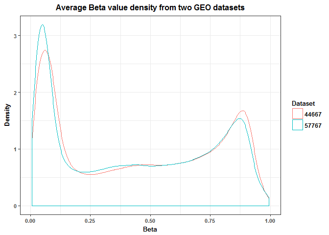

``` r
#After Normalization (Average Beta Values)
DensityPlotting(betaV_data_norm, "Beta")
```

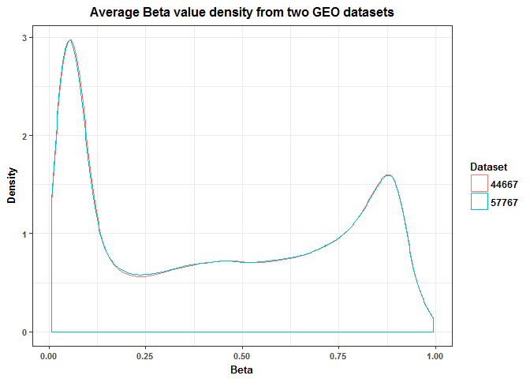

``` r
#Before Normalization (Average M Values)
#DensityPlotting(mV_data, "M")
#After Normalization (Average M Values)
DensityPlotting(mV_data_norm, "M")
```

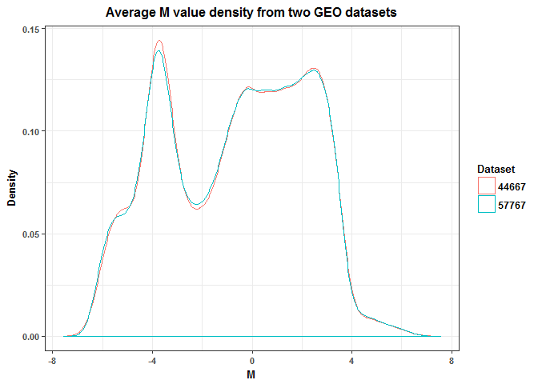

``` r
#Infinite values in M values dataset?
sum(sapply(mV_data_norm, is.infinite))
```

    ## [1] 0

Principal Component Analysis
----------------------------

We conducted principal component analysis on the CpG sites. The skree plot and table of variance proportions explained by the principal components (PCs) indicate that each PC has a corresponding low variance. This was just to get an initial idea of the associations between principal components and our two factors ("Gestational Age" and "Disease Class"). Later on, we perform reference-free deconvolution by PCA on CpG Islands.

``` r
#Scaled data
mV_data_norm_sc = scale(t(mV_data_norm))

#PCA on the CpG sites
PrinComps = prcomp(mV_data_norm_sc, center = FALSE, scale = FALSE)

#Skree plot and table of variance proportions explained by PCs
plot(PrinComps)
```

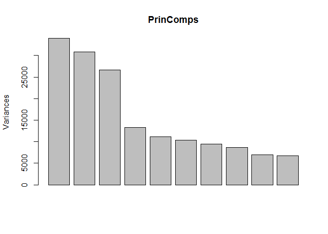

``` r
summary(PrinComps)
```

    ## Importance of components%s:
    ##                              PC1      PC2      PC3       PC4       PC5
    ## Standard deviation     184.32406 175.5632 163.4132 115.19156 105.35197
    ## Proportion of Variance   0.07914   0.0718   0.0622   0.03091   0.02585
    ## Cumulative Proportion    0.07914   0.1509   0.2131   0.24405   0.26991
    ##                              PC6      PC7      PC8     PC9    PC10
    ## Standard deviation     101.59759 97.04171 93.22371 83.6613 81.8465
    ## Proportion of Variance   0.02404  0.02194  0.02024  0.0163  0.0156
    ## Cumulative Proportion    0.29395  0.31589  0.33613  0.3524  0.3680
    ##                            PC11     PC12     PC13     PC14     PC15
    ## Standard deviation     75.30758 74.78810 73.48802 71.24074 70.46765
    ## Proportion of Variance  0.01321  0.01303  0.01258  0.01182  0.01157
    ## Cumulative Proportion   0.38125  0.39428  0.40686  0.41868  0.43025
    ##                            PC16     PC17     PC18    PC19     PC20
    ## Standard deviation     69.04662 68.46756 68.01601 67.1541 66.65202
    ## Proportion of Variance  0.01111  0.01092  0.01078  0.0105  0.01035
    ## Cumulative Proportion   0.44135  0.45227  0.46305  0.4736  0.48390
    ##                            PC21     PC22     PC23     PC24     PC25
    ## Standard deviation     66.53866 66.04111 65.47676 65.25949 64.74050
    ## Proportion of Variance  0.01031  0.01016  0.00999  0.00992  0.00976
    ## Cumulative Proportion   0.49421  0.50437  0.51436  0.52428  0.53404
    ##                            PC26     PC27     PC28     PC29    PC30
    ## Standard deviation     64.31201 64.04639 63.65736 63.57218 63.2029
    ## Proportion of Variance  0.00963  0.00955  0.00944  0.00941  0.0093
    ## Cumulative Proportion   0.54368  0.55323  0.56267  0.57209  0.5814
    ##                            PC31     PC32     PC33     PC34     PC35
    ## Standard deviation     63.09513 62.69170 62.37125 62.12352 62.09778
    ## Proportion of Variance  0.00927  0.00916  0.00906  0.00899  0.00898
    ## Cumulative Proportion   0.59066  0.59982  0.60888  0.61787  0.62685
    ##                            PC36     PC37     PC38     PC39     PC40
    ## Standard deviation     61.61406 61.52996 61.40545 61.23273 61.06970
    ## Proportion of Variance  0.00884  0.00882  0.00878  0.00873  0.00869
    ## Cumulative Proportion   0.63570  0.64451  0.65330  0.66203  0.67072
    ##                            PC41     PC42     PC43     PC44     PC45
    ## Standard deviation     60.89606 60.78164 60.56975 60.20869 59.94818
    ## Proportion of Variance  0.00864  0.00861  0.00855  0.00844  0.00837
    ## Cumulative Proportion   0.67936  0.68796  0.69651  0.70495  0.71332
    ##                            PC46     PC47     PC48     PC49     PC50
    ## Standard deviation     59.88939 59.77802 59.55197 59.45690 59.35081
    ## Proportion of Variance  0.00835  0.00832  0.00826  0.00823  0.00821
    ## Cumulative Proportion   0.72168  0.73000  0.73826  0.74650  0.75470
    ##                           PC51     PC52     PC53     PC54     PC55
    ## Standard deviation     58.9631 58.93573 58.81228 58.69724 58.45136
    ## Proportion of Variance  0.0081  0.00809  0.00806  0.00803  0.00796
    ## Cumulative Proportion   0.7628  0.77089  0.77895  0.78698  0.79493
    ##                            PC56     PC57     PC58    PC59     PC60
    ## Standard deviation     58.38114 58.09390 58.01539 57.8544 57.63824
    ## Proportion of Variance  0.00794  0.00786  0.00784  0.0078  0.00774
    ## Cumulative Proportion   0.80287  0.81074  0.81858  0.8264  0.83411
    ##                            PC61     PC62     PC63     PC64     PC65
    ## Standard deviation     57.40395 57.23525 57.08636 56.86883 56.70951
    ## Proportion of Variance  0.00768  0.00763  0.00759  0.00753  0.00749
    ## Cumulative Proportion   0.84179  0.84942  0.85701  0.86454  0.87203
    ##                            PC66     PC67     PC68     PC69     PC70
    ## Standard deviation     56.52306 56.44565 56.25748 56.07298 55.85352
    ## Proportion of Variance  0.00744  0.00742  0.00737  0.00732  0.00727
    ## Cumulative Proportion   0.87948  0.88690  0.89427  0.90159  0.90886
    ##                            PC71     PC72     PC73     PC74     PC75
    ## Standard deviation     55.71500 55.33163 55.13769 54.85809 54.58087
    ## Proportion of Variance  0.00723  0.00713  0.00708  0.00701  0.00694
    ## Cumulative Proportion   0.91609  0.92322  0.93030  0.93731  0.94425
    ##                            PC76    PC77     PC78     PC79     PC80    PC81
    ## Standard deviation     53.92992 53.6125 53.11633 52.93890 51.26162 50.7474
    ## Proportion of Variance  0.00677  0.0067  0.00657  0.00653  0.00612  0.0060
    ## Cumulative Proportion   0.95103  0.9577  0.96430  0.97082  0.97694  0.9829
    ##                            PC82     PC83     PC84      PC85
    ## Standard deviation     50.46917 49.43380 48.28447 1.269e-12
    ## Proportion of Variance  0.00593  0.00569  0.00543 0.000e+00
    ## Cumulative Proportion   0.98888  0.99457  1.00000 1.000e+00

``` r
#Rowname check
#sum(rownames(PrinComps$rotation) == Meta_data$Sample)

#Append PCs to the metadata
Meta_data_PrinCs = cbind(Meta_data, PrinComps$x[Meta_data$Sample,1:10])

Meta_data_PrinCs_2 = melt(Meta_data_PrinCs, id=c("Sample", "Disease_Class", "Gestational_Age"))

#Relationships between Gestational_Age and PCs
ggplot(data=Meta_data_PrinCs_2, aes(x=Gestational_Age, col=Gestational_Age))+
  facet_wrap(~variable, nrow=2)+
  geom_point(aes(y=value))+
  labs(x="Gestational Period", y="PC Loading", col="Gestational Period")+
  theme_bw()
```

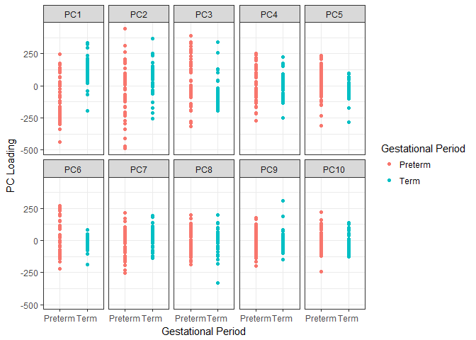

``` r
#Relationships between Disease_Status and PCs
ggplot(data=Meta_data_PrinCs_2, aes(x=Disease_Class, col=Disease_Class))+
  facet_wrap(~variable, nrow=2)+
  geom_point(aes(y=value))+
  labs(x="Disease Class", y="PC Loading", col="Disease Class")+
  theme_bw()+
  theme(axis.text.x = element_text(angle=30, hjust=1, vjust=1))
```

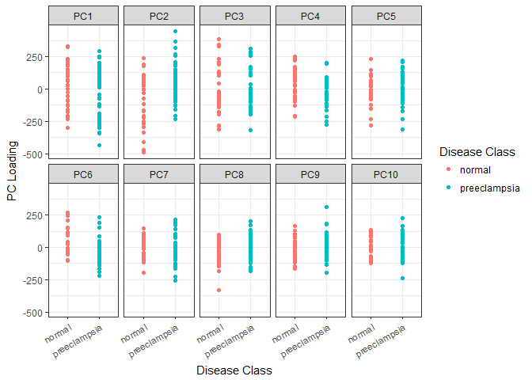

``` r
#Gestational Period localization among top 2 PCs
ggplot(data=Meta_data_PrinCs, aes(x=PC1, y=PC2))+
  geom_point(aes(col=Gestational_Age))+
  labs(x="PC1", y="PC2", col="Gestational Period")+
  theme_bw()
```

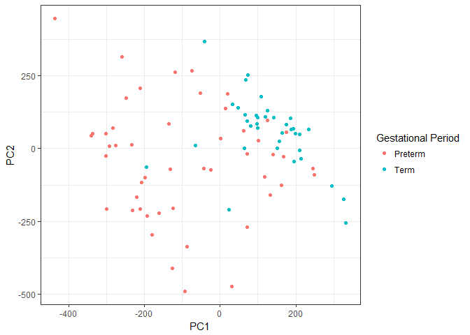

``` r
#Disease Class localization among top 2 PCs
ggplot(data=Meta_data_PrinCs, aes(x=PC1, y=PC2))+
  geom_point(aes(col=Disease_Class))+
  labs(x="PC1", y="PC2", col="Disease Class")+
  theme_bw()
```

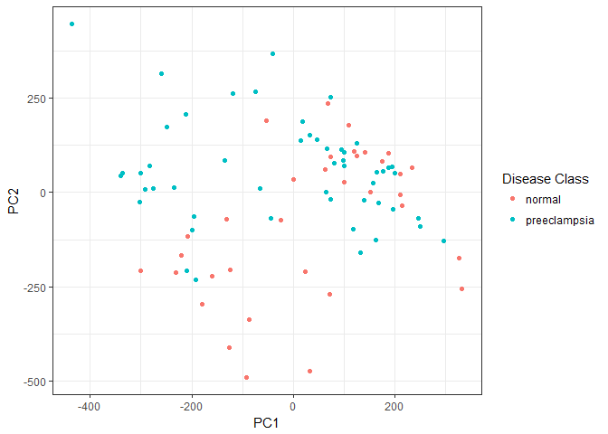

Aggregating CpGs to CpG Islands (CGIs)
--------------------------------------

Here we cluster CpG to CpG Islands. Once CpGs are clustered together, the mean value is taken to represent the Beta/M value of the CpG Island. The "mV\_CGI" object is saved as [M\_CGI\_data.RDS](https://github.com/STAT540-UBC/Repo_team_GenX/blob/master/Data/M_CGI_data.RDS) and the "betaV\_CGI" object is saved as [Beta\_CGI\_data.RDS](https://github.com/STAT540-UBC/Repo_team_GenX/blob/master/Data/Beta_CGI_data.RDS), as we previously mentioned.

``` r
# Annotation data pulled from FDb database  
IM_data = features(FDb.InfiniumMethylation.hg19)
# Grab annotation data from hg19 genome  
IM_meta = metadata(FDb.InfiniumMethylation.hg19)
genome(IM_data) = IM_meta[which(IM_meta[,'name']=='Genome'),'value']
IM_data = sort(IM_data)

# Filter down to probes within the 450k assay 
probes_450k = as.data.frame(IM_data[IM_data$platform %in% c("BOTH","HM450"),])
probes_450k$Probe_ID = rownames(probes_450k)
#cginame_onlycg = probes_450k[probes_450k$probeType == "cg", ]
#Obtain 450k annotation data and connect each probe to a CGI
hm450 = getPlatform(platform='HM450', genome='hg19')
```

    ## Fetching coordinates for hg19...

``` r
probe_UCSC_name = getNearestGene(hm450)

#Filter beta values and M values to only include probes found within CGIs
betaV_CGI = betaV_data_norm[rownames(betaV_data_norm) %in% rownames(probe_UCSC_name),]
mV_CGI = mV_data_norm[rownames(mV_data_norm) %in% rownames(probe_UCSC_name),]
#Filter down CGI metadata to those probes found within our dataset
cginame = probe_UCSC_name[rownames(mV_CGI),]
cginame$cginame = cginame$nearestGeneSymbol
cginame$Probe_ID = rownames(cginame)

# Aggregation of the CpGs to the CGI level
betaV_CGI = aggregate(betaV_CGI, by = list(cginame$nearestGeneSymbol), mean, na.rm = T)
rownames(betaV_CGI) = betaV_CGI[, "Group.1"]
betaV_CGI = betaV_CGI[!(names(betaV_CGI) %in% c("Group.1"))]

mV_CGI = aggregate(mV_CGI, by = list(cginame$nearestGeneSymbol), mean, na.rm = T)
rownames(mV_CGI) = mV_CGI[, "Group.1"]
mV_CGI = mV_CGI[!(names(mV_CGI) %in% c("Group.1"))]
```

Save CGI data
-------------

Here we save the CGI M and Beta values data to the data folder.

``` r
CGI_Data_Loc = paste(substr(getwd(), 1, nchar(getwd())-4),"Data/M_CGI_data.RDS", sep="")
B_CGI_Data_Loc = paste(substr(getwd(), 1, nchar(getwd())-4),"Data/Beta_CGI_data.RDS", sep="")

if(!file.exists(CGI_Data_Loc)){
  saveRDS(mV_CGI, file=CGI_Data_Loc)
  saveRDS(betaV_CGI, file=B_CGI_Data_Loc)
}
```

Initial Agglomerative Hierarchical Clustering
---------------------------------------------

Agglomerative hierarchical clustering was performed on the samples, using all of the CGI M values, Ward's method and the euclidean distance metric. Gestational Age seems to form somewhat well-defined clusters, but the same cannot be said for Disease Class.

``` r
Meta_data_V2 = Meta_data
rownames(Meta_data_V2) = Meta_data_V2$Sample

pheatmap(mV_CGI, cluster_rows = FALSE, scale = "none", clustering_method = "ward.D2", 
    clustering_distance_cols = "euclidean", show_colnames = TRUE, show_rownames = FALSE,
    main = "Clustering for All Samples", annotation = Meta_data_V2[, c("Disease_Class", "Gestational_Age")],
    fontsize_col = 5)
```

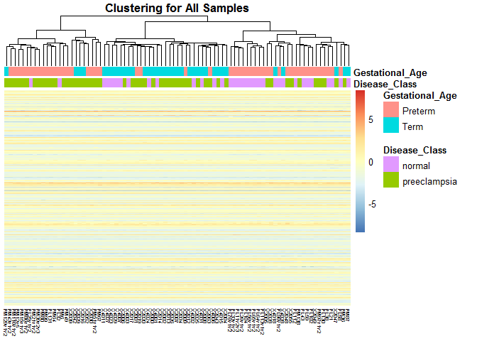

``` r
## Assess stability of clusters (Takes a very long time to run)
#StableClusters = pvclust(mV_CGI, nboot = 100, method.hclust="ward.D2", method.dist="euclidean")
#plot(StableClusters, labels = Meta_data_V2$Sample, cex = 0.5, cex.pv=0.7, float=0.02)
#pvrect(StableClusters, alpha = 0.80)
```

Histogram of the M values across CGIs/Examine normality of response
-------------------------------------------------------------------

We plot the overall distribution of the M values over all CGIs and samples. Additionally, we randomly sample 10 CGIs to observe whether they are close to normally distributed. The general distributions seem close to normal, although there are cases of skewness and uneveness.

``` r
mV_CGI_melt = melt(as.data.frame(t(mV_CGI)))
```

    ## No id variables; using all as measure variables

``` r
ggplot(data = mV_CGI_melt, aes(x = value)) +
   geom_density() + 
   ggtitle("Overall Distribution of M values") + 
   xlab("M value") + 
   ylab("Density") + 
   theme_bw() +
   theme(legend.position="none")
```

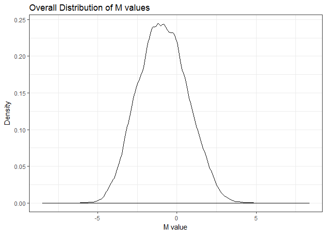

``` r
#random sample of CGIs to examine their distributions
set.seed(50)
mV_CGI_sampnames = rownames(mV_CGI)[sample(nrow(mV_CGI), size=10)]
mV_CGI_melt_samp = mV_CGI_melt[which(mV_CGI_melt$variable %in% mV_CGI_sampnames),]

ggplot(data = mV_CGI_melt_samp, aes(x = value)) +
   facet_wrap(~ variable, nrow=2, scales="free_x")+
   geom_density() + 
   ggtitle("Overall Distribution of M values") + 
   xlab("M value") + 
   ylab("Density") + 
   theme_bw() +
   theme(legend.position="none")
```

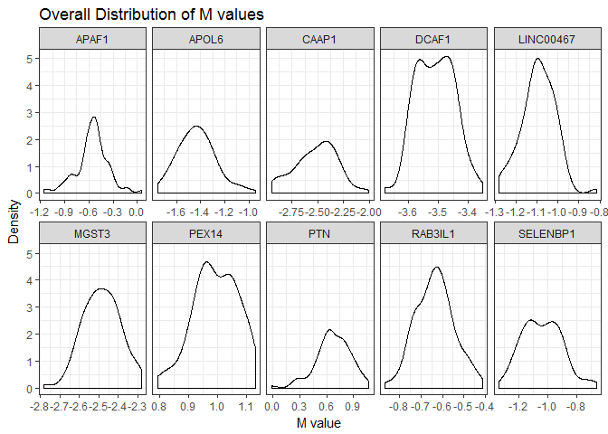

Limma (Standard Linear Regression accounting for multiple testing)
------------------------------------------------------------------

We perform limma on the CGI M values. At a p-value cutoff (FDR) of 0.01, we obtain 87 top differentially methylated (DM) CGIs for Disease Class. Following that, we took the top 10 DM CGIs and examined their differences (in terms of beta values). After, we perform hierarchical clustering on the samples once again, but this time using the top 87 DM CGIs (the same clustering method and distance metric are used). Now for Disease Class, the clusters seem to be relatively well-defined (except the right-most cluster). We also verified this clustering by multiscale bootstrap resampling. This results in two stable clusters (when alpha is set to 0.90). Thus, we decided to retain two classes of Disease Class (instead of including additional sub-classes of preeclampsia). However, it could be argued that the preeclampsia cases that occur in the rightmost cluster could form their own sub-class.

``` r
Design = Meta_data_V2[,c("Disease_Class", "Gestational_Age")]

#Design Matrix
Des_Mat = model.matrix(~ Disease_Class+Gestational_Age, Design)

#Fit standard linear regression models using limma
DM_CGI_fit = lmFit(mV_CGI, Des_Mat)
DM_CGI_EB = eBayes(DM_CGI_fit)
#Top CGIs based on p-value cutoff (FDR) of 0.01 (87 total DM CGIs)
Top_DM_CGIs = topTable(DM_CGI_EB, coef = "Disease_Classpreeclampsia", number = Inf, p.value = 0.01)
#write.csv(Top_DM_CGIs, file = "Top_DM_CGIs.csv")

#Select the top 10 CGIs to examine
Top_DM_CGIs_10 = topTable(DM_CGI_EB, coef = "Disease_Classpreeclampsia", number = 10)
DM_CGI_data_10 = betaV_CGI[rownames(betaV_CGI) %in% rownames(Top_DM_CGIs_10),]
DM_CGI_data_10_t = as.data.frame(t(DM_CGI_data_10))
#Rowname check
#sum(rownames(DM_CGI_data_t) == Meta_data_V2$Sample)
DM_CGI_data_10_t = cbind(Meta_data_V2, DM_CGI_data_10_t)
DM_CGI_data_10_melt = melt(DM_CGI_data_10_t, id=c("Sample", "Disease_Class", "Gestational_Age"))
#Examine differences in beta values among top 10 CGIs
ggplot(data=DM_CGI_data_10_melt, aes(x=Disease_Class, y=value, col=Gestational_Age)) +
  facet_wrap(~variable, nrow=2) +
  geom_point(position = position_jitter(width = 0.1)) +
  theme_bw() +
  stat_summary(fun.y = mean, aes(group=1), geom = "line", color = "black") +
  labs(x="Disease Class", y="Mean CGI Beta Value") +
  ggtitle('Top 10 Differentially Methylated CGI sites') +
  theme(axis.text.x = element_text(angle=30, hjust=1, vjust=1)) +
  theme(strip.text = element_text(face="bold", colour = "white", size=9), strip.background = element_rect(fill = "Darkblue", colour = "white", size = 1)) +
  theme(plot.title = element_text(hjust = 0.5, size = 12, face = "bold"), legend.title=element_text(size = 10, face = "bold") , legend.text=element_text(size = 9, face = "bold")) +
   theme(axis.text=element_text(size = 8,face = "bold"), axis.title=element_text(size = 10,face = "bold")) 
```

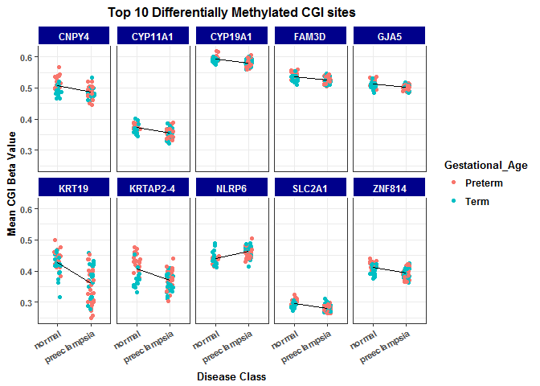

``` r
#Initial glance at clustering structure among the samples given top 87 CGIs
DM_CGI_data = betaV_CGI[rownames(betaV_CGI) %in% rownames(Top_DM_CGIs),]

pheatmap(DM_CGI_data, cluster_rows = TRUE, scale = "none", clustering_method = "ward.D2", 
    clustering_distance_cols = "euclidean", show_colnames = FALSE, show_rownames = FALSE,
    main = "Clustering with Top 87 CGIs", annotation = Meta_data_V2[, c("Disease_Class", "Gestational_Age")],
    fontsize_col = 5, border_color=NA)
```

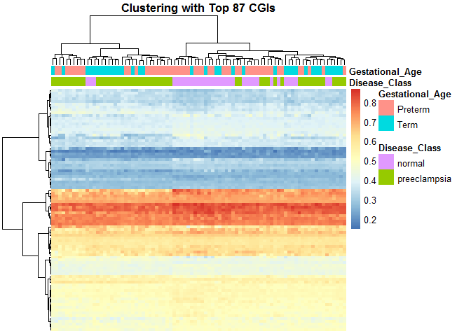

``` r
#Assess stability of these clusters
StableClusters_2 = pvclust(DM_CGI_data, nboot = 1000, method.hclust="ward.D2", method.dist="euclidean")
```

    ## Bootstrap (r = 0.49)... Done.
    ## Bootstrap (r = 0.6)... Done.
    ## Bootstrap (r = 0.69)... Done.
    ## Bootstrap (r = 0.79)... Done.
    ## Bootstrap (r = 0.9)... Done.
    ## Bootstrap (r = 1.0)... Done.
    ## Bootstrap (r = 1.09)... Done.
    ## Bootstrap (r = 1.2)... Done.
    ## Bootstrap (r = 1.3)... Done.
    ## Bootstrap (r = 1.39)... Done.

``` r
plot(StableClusters_2, labels = Meta_data_V2$Sample, cex = 0.5, cex.pv=0.7, float=0.02)
pvrect(StableClusters_2, alpha = 0.90)
```

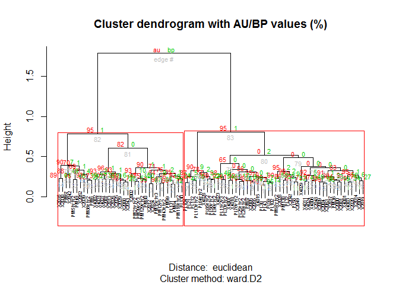

Limma (accounting for batch/cell heterogeneity using reference-free deconvolution)
----------------------------------------------------------------------------------

We first conduct principal component analysis on the CGIs. The proportion of variance explained by each of the PCs is still relatively low, with about 40% being explained in the first 10 PCs and about 50% being explained in the first 20 PCs. We can see that Gestational Age is associated with PC2, but Disease Class is slightly associated with PC1, based on the plots. Then, we performed reference-free deconvolution and thus used the first three PCs as covariates within limma to attempt to account for batch and cell heterogeneity (characteristic of placental tissue). Instead of 87 DM CGIs, we instead obtain 6 DM CGIs (with an FDR of 0.01). Five of these CGIs are also found within the original 87 CGIs. This may mean that some of the original 87 DM CGIs may be false discoveries.

``` r
mV_CGI_PCs_dat = scale(t(mV_CGI))

#Alternate Plot of PCs
sv <- svd(mV_CGI_PCs_dat)

sv_1 <- as.data.frame(cbind(seq(1, length(sv$d)), (sv$d^2)/sum(sv$d^2)))

colnames(sv_1) <- c('Index', 'PC')

lab <- paste0(round(sv_1$PC*100, 1), '%') #Create labels for each bar

ggplot(data = sv_1[1:10, ], aes(x = Index, y = PC)) +
  geom_bar(stat = "identity", fill = "Darkblue") + 
  geom_text(aes(label = lab[1:10]), vjust = 1.6, color = "white", size = 3.5) +
  theme_bw()+
  ggtitle('Principal Component Analysis') +
  xlab('Principal Components') +
  ylab('Proportion of Variance Explained') +
  theme(plot.title = element_text(hjust = 0.5, size = 12, face = "bold")) +
   theme(axis.text=element_text(size = 8,face = "bold"), axis.title=element_text(size = 10,face = "bold")) +
  scale_x_continuous(breaks=1:10, labels=sv_1$Index[1:10])
```

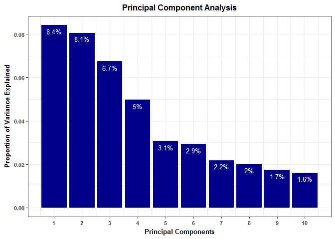

``` r
#PCA on the CGIs
PrinComps_CGI = prcomp(mV_CGI_PCs_dat, center = FALSE, scale = FALSE)

Meta_data_V3 = cbind(Meta_data_V2, PrinComps_CGI$x[Meta_data_V2$Sample,1:10])

Meta_data_V3_melt = melt(Meta_data_V3, id=c("Sample", "Disease_Class", "Gestational_Age"))

#Relationships between Gestational_Age and PCs
ggplot(data=Meta_data_V3_melt, aes(x=Gestational_Age, col=Gestational_Age))+
  facet_wrap(~variable, nrow=2)+
  geom_point(aes(y=value))+
  labs(x="Gestational Period", y="PC Loading", col="Gestational Period")+
  theme_bw()
```

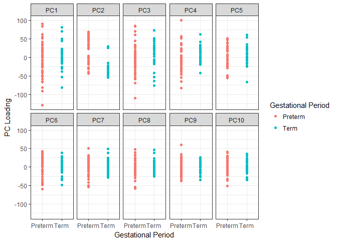

``` r
#Relationships between Disease_Status and PCs
ggplot(data=Meta_data_V3_melt, aes(x=Disease_Class, col=Disease_Class))+
  facet_wrap(~variable, nrow=2)+
  geom_point(aes(y=value))+
  labs(x="Disease Class", y="PC Loading", col="Disease Class")+
  theme_bw()+
  theme(axis.text.x = element_text(angle=30, hjust=1, vjust=1))
```

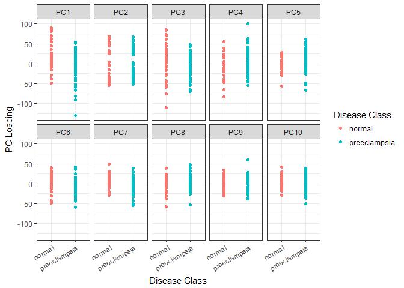

``` r
#Gestational Period localization among top 2 PCs
ggplot(data=Meta_data_V3, aes(x=PC1, y=PC2))+
  geom_point(aes(col=Gestational_Age))+
  labs(x="PC1", y="PC2", col="Gestational Period")+
  theme_bw()
```

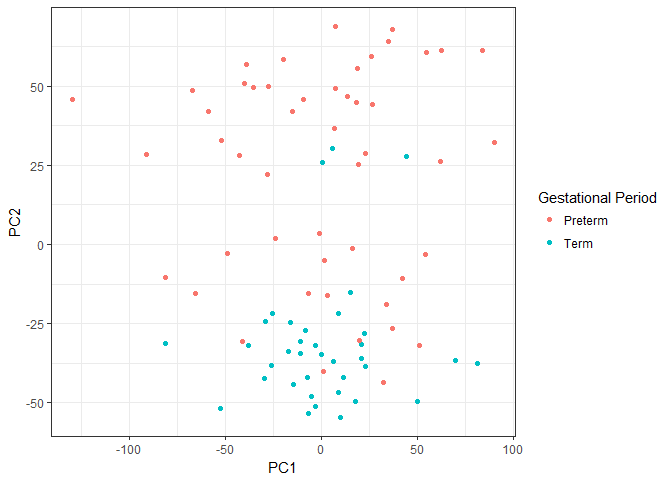

``` r
#Disease Class localization among top 2 PCs
ggplot(data=Meta_data_V3, aes(x=PC1, y=PC2))+
  geom_point(aes(col=Disease_Class))+
  labs(x="PC1", y="PC2", col="Disease Class")+
  theme_bw() +
  ggtitle('Association of Disease Class between PC1 and PC2') +
  theme(plot.title = element_text(hjust = 0.5, size = 12, face = "bold"), legend.title=element_text(size = 10, face = "bold") , legend.text=element_text(size = 9, face = "bold")) +
   theme(axis.text=element_text(size = 8,face = "bold"), axis.title=element_text(size = 10,face = "bold"))
```

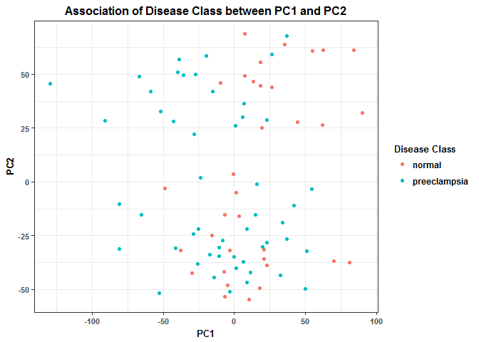

``` r
Design_2 = Meta_data_V3[,c("Disease_Class", "Gestational_Age", "PC1", "PC2", "PC3")]

#Design Matrix (include the first 3 principal components as covariates)
Des_Mat_2 = model.matrix(~ Disease_Class+Gestational_Age+PC1+PC2+PC3, Design_2)

#Fit standard linear regression models using limma
DM_CGI_fit_PCVer = lmFit(mV_CGI, Des_Mat_2)
DM_CGI_EB_PCVer = eBayes(DM_CGI_fit_PCVer)
#Top CGIs based on p-value cutoff (FDR) of 0.01 (6 total DM CGIs)
Top_DM_CGIs_PCVer = topTable(DM_CGI_EB_PCVer, coef = "Disease_Classpreeclampsia", number = Inf, p.value = 0.01)
```

Feature Selection (using limma by CV)
-------------------------------------

Our dataset was subdivided into a 65 sample training set and a 17 sample test set to perform supervised learning, with the aim to predict disease class. To perform feature selection, 5-fold cross-validation was performed on the training set using limma as our model and Disease Class as our response. Among each of the splits, the top 50 CGIs were chosen. This lead to a total of 162 unique CGIs selected as our "informative" features to be used in our supervised learning methods.

``` r
set.seed(25)
#Remove 20% of our samples to be the test set
Test_Set_Index = sample(1:85, 17)

mV_CGI_Train = mV_CGI[-Test_Set_Index]
mV_CGI_Test = mV_CGI[Test_Set_Index]
Meta_data_Train = Meta_data_V2[-Test_Set_Index,]
Meta_data_Test = Meta_data_V2[Test_Set_Index,]

FoldNum = 5

#Create the folds and then use limma on each of the splits to identify potential informative CGIs
Folds = GenerateLearningsets(y = Meta_data_Train$Disease_Class, method="CV", fold=FoldNum, strat = TRUE)
CGI_sels = GeneSelection(X=t(mV_CGI_Train), y=Meta_data_Train$Disease_Class, learningsets=Folds,
                         method="limma", trace = FALSE)
#Determine the top 50 CGIs in each of the splits
CGI_Sel_Set = c()
for(i in 1:FoldNum){
  CGI_Iter = toplist(CGI_sels, iter=i, k = 50, show=FALSE)$index
  CGI_Sel_Set = c(CGI_Sel_Set, rownames(mV_CGI_Train)[CGI_Iter])
}
#identify number of CGIs that appeared for a given number of splits (11 CGIs appeared in all 5 splits)
table(table(CGI_Sel_Set))
```

    ## 
    ##   1   2   3   4   5 
    ## 117  20  13   6   6

``` r
#Total of 162 unique CGIs obtained for supervised learning
CGI_Sel_Set_Final = unique(CGI_Sel_Set)

#Location to save the CGIs obtained from this feature selection (to be used in supervised learning)
CGI_Feat_Selection_Loc = paste(substr(getwd(), 1, nchar(getwd())-4),"Data/CGI_SL_Set.rdata", sep="")

if(!file.exists(CGI_Feat_Selection_Loc)){
  save(CGI_Sel_Set_Final, file=CGI_Feat_Selection_Loc)
}
```
