initial\_analysis
================
Nikolas Krstic
March 16, 2018

``` r
library(RColorBrewer)
library(cluster)
library(pvclust)
library(xtable)
library(limma)
library(plyr)
library(lattice)
library(RCurl)
library(knitr)
library(pheatmap)
library(tidyverse)
library(GEOquery)
library(wateRmelon)
library(FDb.InfiniumMethylation.hg19)
```

Load the data and clean the meta data
-------------------------------------

``` r
#Load pre-normalized beta values
beta_matrix = readRDS("C:/Users/Thrawnssarht/Downloads/unnormalised_b_values.RDS")

#Load the normalized beta and m values (change "file location" to your local location of files)
beta_norm = readRDS("C:/Users/Thrawnssarht/Downloads/normalized_beta_values.RDS")
m_norm = readRDS("C:/Users/Thrawnssarht/Downloads/m_values.RDS")

#Original file to load data
#load("C:/Users/Thrawnssarht/Downloads/normalized_data.Rdata")

#Location of the meta data (odd way of obtaining location because default directory is to Code folder, which
# is for some reason unchangeable with setwd())
meta_data_loc = paste(substr(getwd(), 1, nchar(getwd())-4),"Data/meta_data.csv", sep="")

if(file.exists(meta_data_loc)){
  Meta_data = read.csv(meta_data_loc, header=TRUE, stringsAsFactors = TRUE, row.names=1)
  Meta_data$Sample = as.character(Meta_data$Sample)
}else{

GSE57767 <- getGEO('GSE57767')
GSE44667 <- getGEO('GSE44667')

Meta_data_57767 <- pData(phenoData(GSE57767[[1]]))
Meta_data_44667 <- pData(phenoData(GSE44667[[1]]))

## Review the columns in the meta data
# for(i in 1:ncol(Meta_data_57767)){
#   print(paste("Column is: ", colnames(Meta_data_57767)[i], sep=""))
#   print(table(Meta_data_57767[,i]))
# }

Meta_data_57767 = Meta_data_57767[,(colnames(Meta_data_57767) %in% c("source_name_ch1",
                                                  "disease state:ch1", "gestational classification:ch1"))]

## Review the columns in the meta data
# for(i in 1:ncol(Meta_data_44667)){
#   print(paste("Column is: ", colnames(Meta_data_44667)[i], sep=""))
#   print(table(Meta_data_44667[,i]))
# }

Meta_data_44667 = Meta_data_44667[,(colnames(Meta_data_44667) %in% c("description",
                                                                     "condition:ch1", "gestational age (weeks):ch1"))]

colnames(Meta_data_57767) = c("Sample", "Disease_Class", "Gestational_Age")
colnames(Meta_data_44667) = c("Sample", "Disease_Class", "Gestational_Age")

Meta_data_57767$Sample = paste("X", gsub(" placenta", "", Meta_data_57767$Sample), sep="")
Meta_data_44667$Sample = gsub("Sample name: ", "", Meta_data_44667$Sample)

#Check if columns are the same, and in the same order
sum(colnames(beta_norm) == c(Meta_data_44667$Sample, Meta_data_57767$Sample))

Meta_data_44667[Meta_data_44667$Disease_Class=="Control",]$Disease_Class = "normal"
Meta_data_44667[Meta_data_44667$Disease_Class=="EOPET",]$Disease_Class = "preeclampsia"

Meta_data_44667$Gestational_Age = ifelse(Meta_data_44667$Gestational_Age<37, "Preterm", "Term")

Meta_data = rbind(Meta_data_44667, Meta_data_57767)

# Save the meta data
#currwd = getwd()
#write.csv(Meta_data, paste(currwd, "/Data/meta_data.csv", sep=""))
}

#Final cleaning of data
betaV_data = as.data.frame(beta_matrix)
betaV_data_norm = as.data.frame(beta_norm)
rm(beta_matrix)
rm(beta_norm)

#mV_data = as.data.frame(m_matrix)
mV_data_norm = as.data.frame(m_norm)
rm(m_norm)
```

Exploratory (Beta and M densities)
==================================

``` r
#Function to plot the densities
DensityPlotting = function(data, type){

meanVals = c(rowMeans(data[,1:40], na.rm = T), rowMeans(data[,41:85], na.rm = T)) 
plotDat = data.frame(Type = meanVals,
                      Dataset = rep(c('44667', '57767'), each = nrow(data)))
plot_dens = ggplot(data = plotDat, aes(x = Type, col = Dataset)) +
   geom_density() + 
   ggtitle(paste("Average", type, "value density from two GEO datasets")) + 
   xlab(type) + 
   ylab("Density") + 
   theme_bw()

return(plot_dens)
}

#Before Normalization (Average Beta Values)
DensityPlotting(betaV_data, "Beta")
```

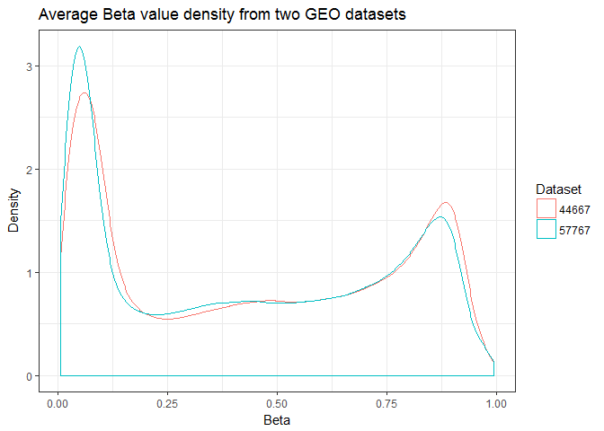

``` r
#After Normalization (Average Beta Values)
DensityPlotting(betaV_data_norm, "Beta")
```

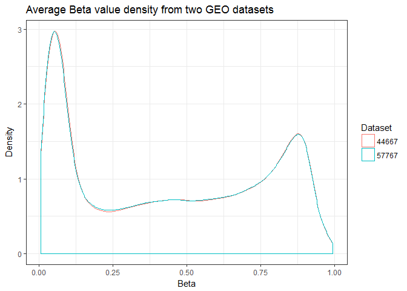

``` r
#Before Normalization (Average M Values)
#DensityPlotting(mV_data, "M")
#After Normalization (Average M Values)
DensityPlotting(mV_data_norm, "M")
```

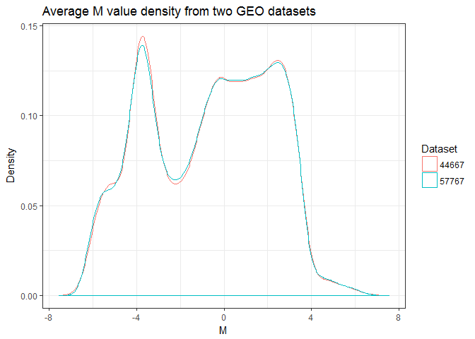

``` r
#Infinite values in M values dataset?
sum(sapply(mV_data_norm, is.infinite))
```

    ## [1] 0

Principal Component Analysis
----------------------------

``` r
#Scaled data
mV_data_norm_sc = scale(t(mV_data_norm))


#PCA on the CpG sites
PrinComps = prcomp(mV_data_norm_sc, center = FALSE, scale = FALSE)

plot(PrinComps)
```

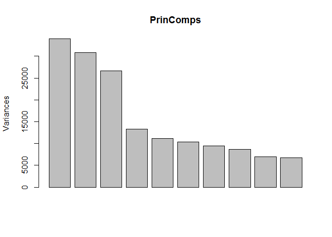

``` r
#Rowname check
#sum(rownames(PrinComps$rotation) == Meta_data$Sample)

#Append PCs to the metadata
Meta_data_PrinCs = cbind(Meta_data, PrinComps$x[Meta_data$Sample,1:10])

Meta_data_PrinCs_2 = melt(Meta_data_PrinCs, id=c("Sample", "Disease_Class", "Gestational_Age"))

#Relationships between Gestational_Age and PCs
ggplot(data=Meta_data_PrinCs_2, aes(x=Gestational_Age, col=Gestational_Age))+
  facet_wrap(~variable)+
  geom_point(aes(y=value))+
  labs(x="Gestational Period", y="PC Loading", col="Gestational Period")+
  theme_bw()
```

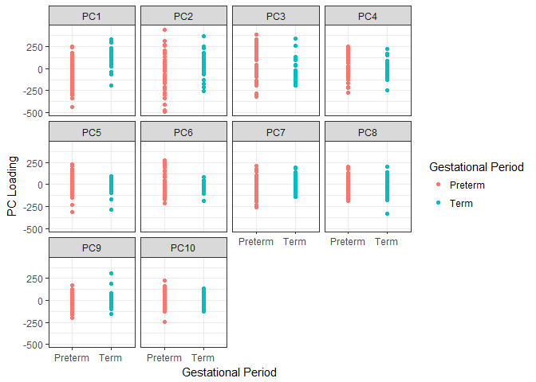

``` r
#Relationships between Disease_Status and PCs
ggplot(data=Meta_data_PrinCs_2, aes(x=Disease_Class, col=Disease_Class))+
  facet_wrap(~variable)+
  theme(axis.text.x = element_text(angle=20))+
  geom_point(aes(y=value))+
  labs(x="Disease Class", y="PC Loading", col="Disease Class")+
  theme_bw()
```

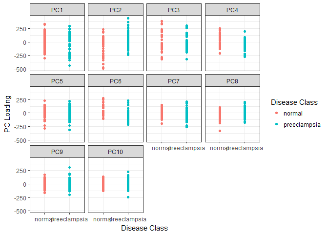

``` r
#Gestational Period localization among top 2 PCs
ggplot(data=Meta_data_PrinCs, aes(x=PC1, y=PC2))+
  geom_point(aes(col=Gestational_Age))+
  labs(x="PC1", y="PC2", col="Gestational Period")+
  theme_bw()
```

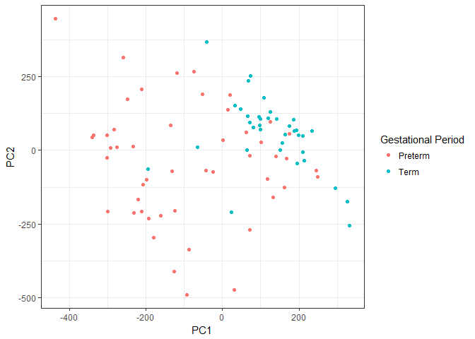

``` r
#Disease Class localization among top 2 PCs
ggplot(data=Meta_data_PrinCs, aes(x=PC1, y=PC2))+
  geom_point(aes(col=Disease_Class))+
  labs(x="PC1", y="PC2", col="Disease Class")+
  theme_bw()
```

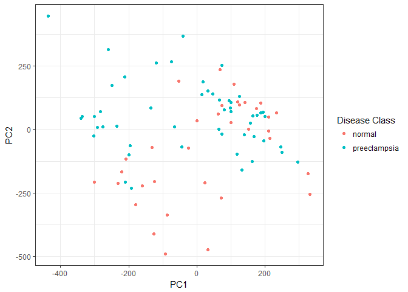

Clustering CpGs to CGIs
-----------------------

``` r
# Annotation data pulled from FDb database  
IM_data = features(FDb.InfiniumMethylation.hg19)
# Grab annotation data from hg19 genome  
IM_meta = metadata(FDb.InfiniumMethylation.hg19)
genome(IM_data) = IM_meta[which(IM_meta[,'name']=='Genome'),'value']
IM_data = sort(IM_data)

# Filter down to probes within the 450k assay 
probes_450k = as.data.frame(IM_data[IM_data$platform %in% c("BOTH","HM450"),])
probes_450k$Probe_ID = rownames(probes_450k)
#cginame_onlycg = probes_450k[probes_450k$probeType == "cg", ]
#Obtain 450k annotation data and connect each probe to a CGI
hm450 = getPlatform(platform='HM450', genome='hg19')
```

    ## Fetching coordinates for hg19...

``` r
probe_UCSC_name = getNearestGene(hm450)

#Filter beta values and M values to only include probes found within CGIs
betaV_CGI = betaV_data_norm[rownames(betaV_data_norm) %in% rownames(probe_UCSC_name),]
mV_CGI = mV_data_norm[rownames(mV_data_norm) %in% rownames(probe_UCSC_name),]
#Filter down CGI metadata to those probes found within our dataset
cginame = probe_UCSC_name[rownames(mV_CGI),]
cginame$cginame = cginame$nearestGeneSymbol
cginame$Probe_ID = rownames(cginame)

# Aggregation of the CpGs to the CGI level
betaV_CGI = aggregate(betaV_CGI, by = list(cginame$nearestGeneSymbol), mean, na.rm = T)
rownames(betaV_CGI) = betaV_CGI[, "Group.1"]
betaV_CGI = betaV_CGI[!(names(betaV_CGI) %in% c("Group.1"))]

mV_CGI = aggregate(mV_CGI, by = list(cginame$nearestGeneSymbol), mean, na.rm = T)
rownames(mV_CGI) = mV_CGI[, "Group.1"]
mV_CGI = mV_CGI[!(names(mV_CGI) %in% c("Group.1"))]
```

Initial Agglomerative Hierarchical Clustering
---------------------------------------------

``` r
Meta_data_V2 = Meta_data
rownames(Meta_data_V2) = Meta_data_V2$Sample

pheatmap(mV_CGI, cluster_rows = FALSE, scale = "none", clustering_method = "ward.D2", 
    clustering_distance_cols = "euclidean", show_colnames = TRUE, show_rownames = FALSE,
    main = "Clustering for All Samples", annotation = Meta_data_V2[, c("Disease_Class", "Gestational_Age")],
    fontsize_col = 5)
```

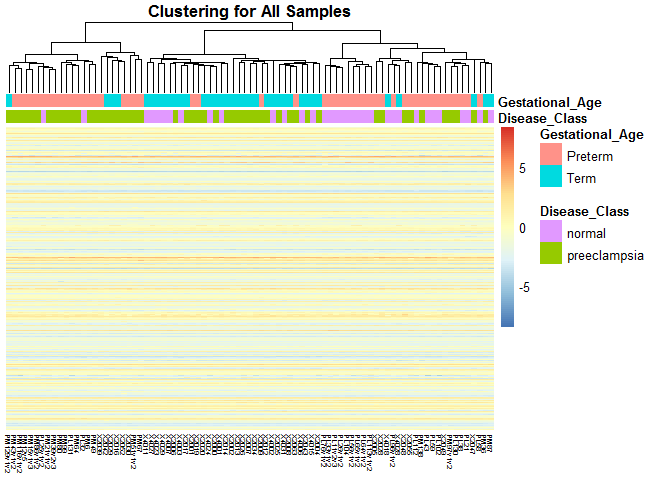

``` r
## Assess stability of clusters (Takes a very long time to run)
#StableClusters = pvclust(mV_CGI, nboot = 100, method.hclust="ward.D2", method.dist="euclidean")
#plot(StableClusters, labels = Meta_data_V2$Sample, cex = 0.5, cex.pv=0.7, float=0.02)
#pvrect(StableClusters, alpha = 0.80)
```

Limma (Standard Linear Regression accounting for multiple testing)
------------------------------------------------------------------

``` r
#Examine density of the response (which is average CGI M values for each probe)
DensityPlotting(mV_CGI, "M")
```

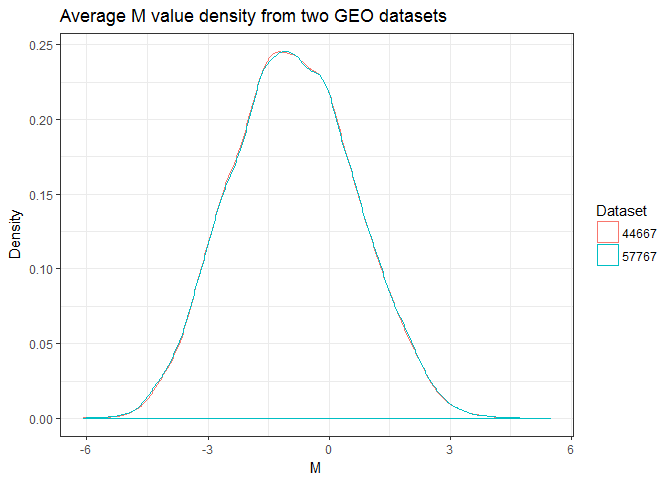

``` r
Design = Meta_data_V2[,c("Disease_Class", "Gestational_Age")]

#Design Matrix
Des_Mat = model.matrix(~ Disease_Class+Gestational_Age, Design)

#Fit standard linear regression models using limma
DM_CGI_fit = lmFit(mV_CGI, Des_Mat)
DM_CGI_EB = eBayes(DM_CGI_fit)
#Top CGIs based on p-value cutoff (FDR) of 0.01 (87 total DM CGIs)
Top_DM_CGIs = topTable(DM_CGI_EB, coef = "Disease_Classpreeclampsia", number = Inf, p.value = 0.01)

#Select the top 10 CGIs to examine
Top_DM_CGIs_10 = topTable(DM_CGI_EB, coef = "Disease_Classpreeclampsia", number = 10)
DM_CGI_data_10 = betaV_CGI[rownames(betaV_CGI) %in% rownames(Top_DM_CGIs_10),]
DM_CGI_data_10_t = as.data.frame(t(DM_CGI_data_10))
#Rowname check
#sum(rownames(DM_CGI_data_t) == Meta_data_V2$Sample)
DM_CGI_data_10_t = cbind(Meta_data_V2, DM_CGI_data_10_t)
DM_CGI_data_10_melt = melt(DM_CGI_data_10_t, id=c("Sample", "Disease_Class", "Gestational_Age"))

#Examine differences in beta values among top 10 CGIs
ggplot(data=DM_CGI_data_10_melt, aes(x=Disease_Class, y=value, col=Gestational_Age))+
  facet_wrap(~variable, nrow=2)+
  geom_point(position = position_jitter(width = 0.1))+
  theme_bw()+
  stat_summary(fun.y = mean, aes(group=1), geom = "line", color = "black")+
  labs(x="Disease Class", y="Mean CGI Beta Value")+
  theme(axis.text.x = element_text(angle=30, hjust=1, vjust=1)) 
```

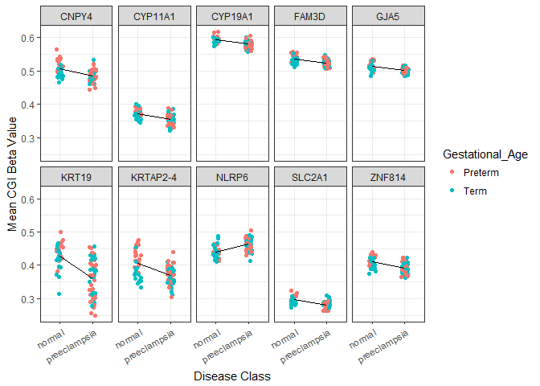

``` r
#Initial glance at clustering structure among the samples given top 87 CGIs
DM_CGI_data = betaV_CGI[rownames(betaV_CGI) %in% rownames(Top_DM_CGIs),]

pheatmap(DM_CGI_data, cluster_rows = FALSE, scale = "none", clustering_method = "ward.D2", 
    clustering_distance_cols = "euclidean", show_colnames = TRUE, show_rownames = FALSE,
    main = "Clustering with Top 87 CGIs", annotation = Meta_data_V2[, c("Disease_Class", "Gestational_Age")],
    fontsize_col = 5)
```

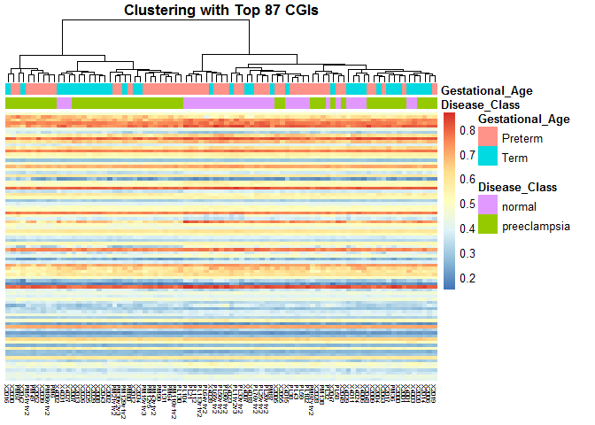

``` r
#Assess stability of these clusters
StableClusters_2 = pvclust(DM_CGI_data, nboot = 500, method.hclust="ward.D2", method.dist="euclidean")
```

    ## Bootstrap (r = 0.49)... Done.
    ## Bootstrap (r = 0.6)... Done.
    ## Bootstrap (r = 0.69)... Done.
    ## Bootstrap (r = 0.79)... Done.
    ## Bootstrap (r = 0.9)... Done.
    ## Bootstrap (r = 1.0)... Done.
    ## Bootstrap (r = 1.09)... Done.
    ## Bootstrap (r = 1.2)... Done.
    ## Bootstrap (r = 1.3)... Done.
    ## Bootstrap (r = 1.39)... Done.

``` r
plot(StableClusters_2, labels = Meta_data_V2$Sample, cex = 0.5, cex.pv=0.7, float=0.02)
pvrect(StableClusters_2, alpha = 0.90)
```

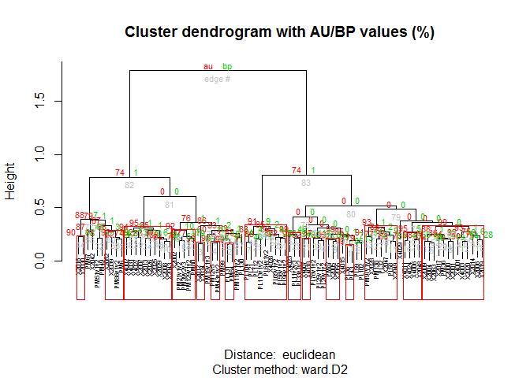
