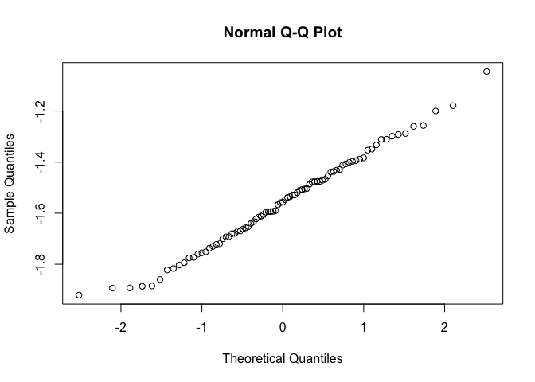
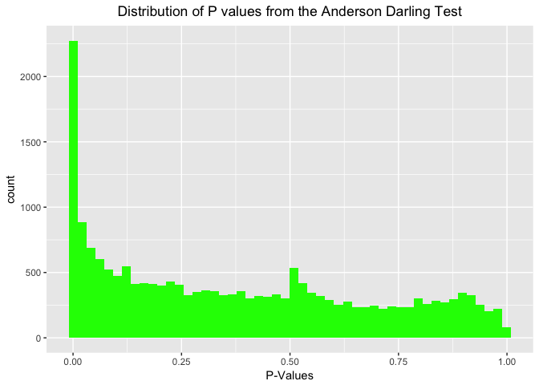
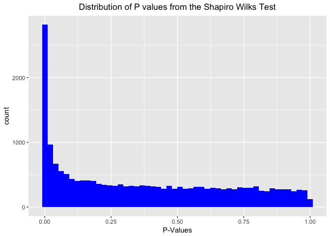

Normality Check
================
Abdullah Farouk
2018-04-01

Load libraries
==============

``` r
library(nortest)
library(dplyr)
```

    ## 
    ## Attaching package: 'dplyr'

    ## The following objects are masked from 'package:stats':
    ## 
    ##     filter, lag

    ## The following objects are masked from 'package:base':
    ## 
    ##     intersect, setdiff, setequal, union

``` r
library(tidyverse)
```

    ## ── Attaching packages ────────────────────────────────── tidyverse 1.2.1 ──

    ## ✔ ggplot2 2.2.1     ✔ readr   1.1.1
    ## ✔ tibble  1.4.2     ✔ purrr   0.2.4
    ## ✔ tidyr   0.8.0     ✔ stringr 1.3.0
    ## ✔ ggplot2 2.2.1     ✔ forcats 0.3.0

    ## ── Conflicts ───────────────────────────────────── tidyverse_conflicts() ──
    ## ✖ dplyr::filter() masks stats::filter()
    ## ✖ dplyr::lag()    masks stats::lag()

``` r
library(ggplot2)
```

Read data in
============

``` r
CGI_Data_Loc = paste(substr(getwd(), 1, nchar(getwd())-4),"Data/M_CGI_data.RDS", sep="")

m_val_CGI <- readRDS(CGI_Data_Loc)
```

Here we test if CGI sites M values are normally distributed. Our null hypothesis is that all the rows of the m\_val\_CGI matrix are normally distributed. Our alternative is that they are not. To perform this check we use two tests. They are the Anderson-Darling and the Shapiro-Wilks test. To control the number of false positives that may arise as a result of multiple hypothesis testing we us a bonferroni correction on the significance threshold.

Carry out tests of Normality on m values of the different CGI columns
=====================================================================

``` r
#Look at the data 
x <- m_val_CGI[3, ] %>% as.matrix()
qqnorm(x) #Data looks pretty normally distributed
```



``` r
#Anderson Darling Test of Normality
ad_test <- ad.test(x)

#Shapiro Wilks Test
sw_test <- shapiro.test(x)

#Initialization
ad_test_pval <- c()
sw_test_pval <- c()

#for loop to go through all 19315 CGI sites
for(i in 1:nrow(m_val_CGI)) {
  x <- m_val_CGI[i, ] %>% as.matrix()
  ad_test_pval <- c(ad_test_pval, ad.test(x)$p.value)
  sw_test_pval <- c(sw_test_pval, shapiro.test(x)$p.value)
}

# Use bonferroni correction to adjust for multiple hypothesis testing
b <- 0.05/nrow(m_val_CGI) #Bonferroni adjusted threshold is 2.588662e-06
length(which(ad_test_pval < b))/nrow(m_val_CGI)
```

    ## [1] 0.03923894

``` r
length(which(sw_test_pval < b))/nrow(m_val_CGI)
```

    ## [1] 0.04222956

``` r
# Data frame to store p value
pval <- data.frame(cbind(ad_test_pval, sw_test_pval))

#Plot the results 
ggplot(pval, aes(x=ad_test_pval)) + geom_histogram(bins=50, fill = 'green') + xlab('P-Values') + ggtitle('Distribution of P values from the Anderson Darling Test') + theme(plot.title = element_text(hjust = 0.5))
```



``` r
ggplot(pval, aes(x=sw_test_pval)) + geom_histogram(bins=50, fill = 'blue') + xlab('P-Values') + ggtitle('Distribution of P values from the Shapiro Wilks Test') + theme(plot.title = element_text(hjust = 0.5))
```



The two methods suggests that only 3 ~ 4% of our rows have a pvalue smaller than the critical threshold. Approximately 96% of our rows seem to have p values larger than the critical threshold. For these rows, we find insufficient evidence to reject our null that they are normally distributed. Thus we find credible evidence that our methylated CGI sites are normally distributed.
