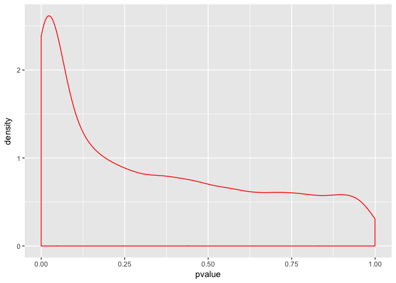

Seminar 3
================
Abdullah Farouk
2018-01-24

``` r
#source("https://bioconductor.org/biocLite.R")
#biocLite("GEOquery","biomaRt") 
library(GEOquery)
library(biomaRt)
#install.packages("tidyverse")
library(tidyverse)
#install.packages("data.table")
library(data.table)
#install.packages("reshape2")
library(reshape2)
library(dplyr)
library(ggplot2)
```

``` r
gds <- getGEO("GDS507")
```

    ## File stored at:

    ## /var/folders/h1/twl48y653xdd70k7gfzmtpm00000gn/T//Rtmp4pt35k/GDS507.soft.gz

``` r
#we can use str() to peak at the structure of a data object. 
#str(gds)

meta_data <- data.frame(Sample = gds@dataTable@columns$sample, disease = gds@dataTable@columns$disease.state)
#we grab this info from the appropriate slots above. 

data_0 <- gds@dataTable@table
head(data_0)
```

    ##        ID_REF IDENTIFIER GSM11815 GSM11832 GSM12069 GSM12083 GSM12101
    ## 1 200000_s_at      PRPF8   4254.0   5298.2   4026.5   3498.4   3566.4
    ## 2   200001_at     CAPNS1  17996.2  12010.7  10283.5   2534.7  11048.4
    ## 3   200002_at      RPL35  41678.8  39116.9  38758.9  32847.7  39633.9
    ## 4 200003_s_at    MIR6805  65390.9  34806.2  31257.2  28308.5  67447.5
    ## 5   200004_at     EIF4G2  19030.1  15813.6  16355.7   9579.7  14273.5
    ## 6   200005_at      EIF3D   8824.5   9706.2  10590.0   6986.7   9400.4
    ##   GSM12106 GSM12274 GSM12299 GSM12412 GSM11810 GSM11827 GSM12078 GSM12099
    ## 1   4903.1   6372.6   4829.1   5205.8   2756.8   3932.0   3729.9   3223.4
    ## 2  13354.0   8563.8  17247.6  16018.5   6077.0  15703.8  10138.5  11614.4
    ## 3  43511.2  46856.7  47032.4  22152.2  26660.7  26373.6  23809.6  24749.3
    ## 4  56989.9  57972.5  57570.5  29062.2  35140.9  23629.3  22100.5  21651.0
    ## 5  17217.0  19116.9  17487.6  14671.6  17733.1  18022.4  17957.4  15958.0
    ## 6  12835.2  10299.0  12375.2   7645.4   8661.5   7355.7   6973.4   6855.9
    ##   GSM12269 GSM12287 GSM12301 GSM12448
    ## 1   3640.5   4886.3   4070.2   3482.1
    ## 2   8460.5  10282.6  11844.3   9741.6
    ## 3  21936.8  31462.8  22733.7  25395.5
    ## 4  18550.7  23496.5  21315.4  28631.4
    ## 5  15799.8  16685.8  18817.3  17421.1
    ## 6   7949.2   9486.5   7494.5   7252.1

``` r
#We exclude the first and second columns because they hold the probe and gene names, respectively.
apply(data_0[,-c(1, 2)], 2, median)
```

    ## GSM11815 GSM11832 GSM12069 GSM12083 GSM12101 GSM12106 GSM12274 GSM12299 
    ##    265.6    250.3    218.5    309.7    281.9    240.1    280.2    217.0 
    ## GSM12412 GSM11810 GSM11827 GSM12078 GSM12099 GSM12269 GSM12287 GSM12301 
    ##    264.4    273.8    264.6    266.5    269.3    288.6    238.7    244.5 
    ## GSM12448 
    ##    264.3

``` r
# Use spread and gather functions
melted_data <- melt(data_0, id.vars = c("ID_REF", "IDENTIFIER"), var = "Sample")
head(melted_data)
```

    ##        ID_REF IDENTIFIER   Sample   value
    ## 1 200000_s_at      PRPF8 GSM11815  4254.0
    ## 2   200001_at     CAPNS1 GSM11815 17996.2
    ## 3   200002_at      RPL35 GSM11815 41678.8
    ## 4 200003_s_at    MIR6805 GSM11815 65390.9
    ## 5   200004_at     EIF4G2 GSM11815 19030.1
    ## 6   200005_at      EIF3D GSM11815  8824.5

``` r
#calculate the mean gene expression per sample
melted_data %>% 
    group_by(Sample) %>% 
    summarize(mean = mean(value))
```

    ## # A tibble: 17 x 2
    ##      Sample     mean
    ##      <fctr>    <dbl>
    ##  1 GSM11815 750.7509
    ##  2 GSM11832 742.4145
    ##  3 GSM12069 747.8430
    ##  4 GSM12083 735.2105
    ##  5 GSM12101 803.1214
    ##  6 GSM12106 744.1075
    ##  7 GSM12274 760.8317
    ##  8 GSM12299 801.8423
    ##  9 GSM12412 685.3858
    ## 10 GSM11810 765.1143
    ## 11 GSM11827 780.1470
    ## 12 GSM12078 774.4252
    ## 13 GSM12099 765.9055
    ## 14 GSM12269 710.3428
    ## 15 GSM12287 791.4746
    ## 16 GSM12301 769.9315
    ## 17 GSM12448 757.1167

``` r
new_melted_data <- melted_data %>% 
    group_by(Sample, IDENTIFIER) %>% 
    summarize(Count = mean(value))
```

The biomaRt package is very useful in this regard. It accesses the ensembl database of gene names and annotations (ensembl.org). biomaRt can help us convert ensemble ids (eg. ENSGXXXXX) into HGNC symbols (i.e BRCA1), for example, along with a host of other things.

Say we want to learn more about the gene expression on a particular chromosome, across all samples. We can use biomaRt to look up the chromosomal location of each gene. Read the biomaRt manual for more detailed explanation of the following bit of code.

``` r
#open connection between biomaRt and R. 
# human = useMart("ensembl", dataset = "hsapiens_gene_ensembl")
# #function that takes in data frame, and outputs same data frame with associated chromosome annotations.
# identify_gene_names <- function(df){
#      names(df) <- c("Sample", "hgnc_symbol", "Count")
#      names <- getBM( attributes=c("hgnc_symbol", "chromosome_name") , filters= "hgnc_symbol", values = df$hgnc_symbol, mart = human)
#      left_join(df, names, by = "hgnc_symbol")
#  }
data <- read.csv('biomart_output.csv', header = TRUE)
head(data)
```

    ##     Sample     hgnc_symbol   Count chromosome_name
    ## 1 GSM11815           ABCF1  3488.0               6
    ## 2 GSM11815          ANAPC5  2451.5              12
    ## 3 GSM11815            ARF3  6017.4              12
    ## 4 GSM11815         ATP6V0B  4619.9               1
    ## 5 GSM11815        ATP6V0E1  5229.3               5
    ## 6 GSM11815 ATP6V1G2-DDX39B 12970.0               6

``` r
#There's a lot of variation in how the chromosomal location is annotated. To simplify things, let's filter out all genes with annotations that are not numeric numbers between 1 and 23, X or Y. 
data_with_chromosome <- data %>% 
    filter(chromosome_name %in% c(1:23, "X", "Y"))
head(data_with_chromosome)
```

    ##     Sample     hgnc_symbol   Count chromosome_name
    ## 1 GSM11815           ABCF1  3488.0               6
    ## 2 GSM11815          ANAPC5  2451.5              12
    ## 3 GSM11815            ARF3  6017.4              12
    ## 4 GSM11815         ATP6V0B  4619.9               1
    ## 5 GSM11815        ATP6V0E1  5229.3               5
    ## 6 GSM11815 ATP6V1G2-DDX39B 12970.0               6

Let's say we're interested in how the average expression of genes on the X chromosome changes between RCC and normal cells.

The first thing we will do is combine information from the meta data file (meta\_data) with our expression table (data\_with\_chromosome). Then we will use dplyr verbs to first group all samples by disease status, filter out all non-X-chromosome genes, and then calcualte the mean using summarize().

``` r
full_data <- left_join(data_with_chromosome, meta_data, by = "Sample")
full_data %>% 
    group_by(disease) %>% 
    filter(chromosome_name == "X") %>% 
    summarize(mean = mean(Count))
```

    ## # A tibble: 2 x 2
    ##   disease     mean
    ##    <fctr>    <dbl>
    ## 1  normal 729.0331
    ## 2     RCC 673.7620

Being able to graph these results is useful, but what we really want to do run statistical tests on the data. There are a variety of ways to do that which will be explored in subsequent lectures. But in this seminar we will focus on doing this using dplyr.

In this case, we want to identify the genes that are differentially expressed between the normal and RCC samples. We will use summarize() to perform a t-test for each gene.

Deliverable
===========

``` r
data_1 <- full_data %>% 
    group_by(hgnc_symbol) %>% 
    summarize( pvalue = t.test(Count ~ disease)$p.value)
```

1.  Make a density plot using geom\_density() of the p-value distributions of the above t-test

``` r
ggplot(data_1, aes(x=pvalue)) + geom_density(col = 'Red')
```



1.  Also, extract a data frame of all genes with p-values lower than 0.05. Finally, extract the name of the gene with the lowest p-value.

``` r
#Create a data frame with p values less than 0.05
data_2 <- filter(data_1, pvalue < 0.05)

#Get name of gene with lowest pvalue
lowest_p_value <- min(data_2$pvalue)
gene_name <- filter(data_2, pvalue == lowest_p_value)
gene_name <- select(gene_name, hgnc_symbol)
gene_name
```

    ## # A tibble: 1 x 1
    ##   hgnc_symbol
    ##        <fctr>
    ## 1       CLDN2

``` r
#Alternative
data_1[which.min(data_1$pvalue),]
```

    ## # A tibble: 1 x 2
    ##   hgnc_symbol       pvalue
    ##        <fctr>        <dbl>
    ## 1       CLDN2 5.911385e-09
