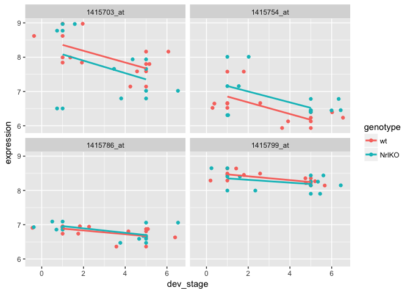

Seminar 4
================
Abdullah Farouk
2018-01-31

Seminar 4
=========

Create Expression Matrix
------------------------

``` r
setwd("/Users/abdullah/Desktop/Stat 540 - High Dimensional Biology/Seminars/Seminar 4 files")

expressionMatrix <- read.table("GSE4051_data.txt", stringsAsFactors = FALSE, sep = "\t", 
                                                             quote = "")
expressionMatrix <- expressionMatrix %>% rownames_to_column("gene") # rownames deprecated in tibbles and are hard to work with in ggplot
expressionMatrix <- expressionMatrix %>% as_tibble() # turn into tibble for pretty printing


#Sample metadata dataset
samplesMetadata <- read.table("metadata.txt", header = TRUE, stringsAsFactors = FALSE) # set stringAsFactors to avoid setting everything as factors, we can control that ourselves

samplesMetadata <- samplesMetadata %>% as_tibble() # turn into tibble for pretty printing

# define our own column names for samples metadata for clarity
names(samplesMetadata) <- c("sample_id", "sample_number", "dev_stage", "genotype")

#convert variables into factors
samplesMetadata$dev_stage <- samplesMetadata$dev_stage %>% factor(levels = c("E16", "P2", "P6", "P10", "4_weeks"))
samplesMetadata$genotype <- samplesMetadata$genotype %>% factor(levels = c("wt", "NrlKO"))
```

Function to transform the data frame into the format that matches the sample metadata
-------------------------------------------------------------------------------------

``` r
transformGeneExpressionMatrix <- function(expressionMatrix) {
  expressionMatrix <- expressionMatrix %>%
    as.data.frame() %>% 
    column_to_rownames("gene") %>%
    t() %>% as.data.frame() %>% 
    rownames_to_column("sample_id") %>% 
    melt(id = "sample_id") %>% 
    as_tibble() %>% 
    select(sample_id,
           gene = variable, 
           expression = value)
  return(expressionMatrix)
}
```

Function for pulling expression data for given samples
------------------------------------------------------

``` r
getExpressionForSamples <- function(sampleIds, expressionMatrix) {
  # use gene column as row name
  dataFrame <- expressionMatrix %>% 
    as.data.frame() %>% 
    column_to_rownames("gene")
  # use give sampleIds to pull out the subset of interest (ORDERING OF SAMPLES IS VERY IMPORTANT)
  return(dataFrame[sampleIds])
}
```

Plot top genes
--------------

``` r
plotGenes <- function(genes, expressionMatrix, samplesMetadata) {
  
  expressionDataForGenes <- expressionMatrix %>% 
    rownames_to_column("gene") %>% 
    filter(gene %in% genes) %>%
    transformGeneExpressionMatrix() %>% 
    left_join(samplesMetadata, id = "sample_id")
  
  expressionDataForGenes %>% 
    ggplot(aes(x = dev_stage, y = expression, color = genotype)) +
    geom_point() +
    geom_jitter() +
    stat_summary(aes(y = expression, group=1), fun.y = mean, geom="line") +
    facet_wrap(~gene)
}
```

Assesing interaction
--------------------

``` r
# for simplification, let's look at only a two-by-two design, we'll filter for developmental stages E16 and 4_weeks
interactionSamples <- samplesMetadata %>% filter(dev_stage %in% c("E16", "4_weeks"))

# IMPORTANT - you want to adjust factor levels here to eliminate stages P2, P6, and P10 from your design matrix
interactionSamples$dev_stage <- interactionSamples$dev_stage %>% 
  as.character() %>% 
  factor(levels = c("E16", "4_weeks"))

# reminder of what samples metadata look like - all samples
interactionSamples
```

    ## # A tibble: 15 x 4
    ##    sample_id sample_number dev_stage genotype
    ##        <chr>         <int>    <fctr>   <fctr>
    ##  1 Sample_20            20       E16       wt
    ##  2 Sample_21            21       E16       wt
    ##  3 Sample_22            22       E16       wt
    ##  4 Sample_23            23       E16       wt
    ##  5 Sample_16            16       E16    NrlKO
    ##  6 Sample_17            17       E16    NrlKO
    ##  7  Sample_6             6       E16    NrlKO
    ##  8 Sample_36            36   4_weeks       wt
    ##  9 Sample_37            37   4_weeks       wt
    ## 10 Sample_38            38   4_weeks       wt
    ## 11 Sample_39            39   4_weeks       wt
    ## 12 Sample_11            11   4_weeks    NrlKO
    ## 13 Sample_12            12   4_weeks    NrlKO
    ## 14  Sample_2             2   4_weeks    NrlKO
    ## 15  Sample_9             9   4_weeks    NrlKO

``` r
# reuse getExpressionForSamples() to get expression data for the samples that we want
expressionDataForInteractionSamples <- getExpressionForSamples(interactionSamples$sample_id, expressionMatrix)
head(expressionDataForInteractionSamples)
```

    ##              Sample_20 Sample_21 Sample_22 Sample_23 Sample_16 Sample_17
    ## 1415670_at       7.236     7.414     7.169     7.070     7.383     7.337
    ## 1415671_at       9.478    10.020     9.854    10.130     7.637    10.030
    ## 1415672_at      10.010    10.040     9.913     9.907     8.423    10.240
    ## 1415673_at       8.362     8.374     8.404     8.487     8.363     8.371
    ## 1415674_a_at     8.585     8.615     8.520     8.641     8.509     8.893
    ## 1415675_at       9.591     9.719     9.709     9.700     9.656     9.614
    ##              Sample_6 Sample_36 Sample_37 Sample_38 Sample_39 Sample_11
    ## 1415670_at      7.240     7.250     7.035     7.374     7.131     7.421
    ## 1415671_at      9.709     9.664     8.381     9.436     8.730     9.831
    ## 1415672_at     10.170     9.514     9.206     9.485     9.526    10.000
    ## 1415673_at      8.835     8.491     8.754     8.495     8.647     8.595
    ## 1415674_a_at    8.542     8.419     8.257     8.339     8.283     8.427
    ## 1415675_at      9.672     9.669     9.547     9.327     9.454     9.598
    ##              Sample_12 Sample_2 Sample_9
    ## 1415670_at       7.109    7.351    7.322
    ## 1415671_at       9.714    9.658    9.798
    ## 1415672_at       9.429    9.914    9.847
    ## 1415673_at       8.427    8.404    8.404
    ## 1415674_a_at     8.498    8.373    8.458
    ## 1415675_at       9.740    9.455    9.508

``` r
# construct the design matrix to include all groups for genotype and developmental stages plus the interaction terms
interactionDesign <- model.matrix(~genotype*dev_stage, interactionSamples)
```

Fitting a model
---------------

``` r
# first fit the model
interactionFit <- lmFit(expressionDataForInteractionSamples, interactionDesign) %>% eBayes()

cutoff <- 0.85
changeDirections <- decideTests(interactionFit, p.value = cutoff, method = "global") %>% 
  as.data.frame() %>% 
  rownames_to_column("gene") %>% 
  as_tibble()

# look for no interaction between genotype and developmental stages. 
hits <- changeDirections %>% filter(dev_stage4_weeks < 0,  `genotypeNrlKO:dev_stage4_weeks` == 0)

# lets try plotting 5 on this list
expressionDataForHits <- expressionDataForInteractionSamples %>% 
  rownames_to_column("gene") %>% 
  filter(gene %in% hits$gene[1:4]) %>%
  transformGeneExpressionMatrix() %>% 
  left_join(samplesMetadata, id = "sample_id")
```

    ## Joining, by = "sample_id"

``` r
expressionDataForHits$dev_stage <- expressionDataForHits$dev_stage %>% as.numeric()

#Plot interactions
expressionDataForHits %>%
  ggplot(aes(x = dev_stage, y = expression, color = genotype)) +
  geom_point() +
  geom_jitter() +
  geom_smooth(method = "lm", se = FALSE) +
  facet_wrap(~gene)
```


