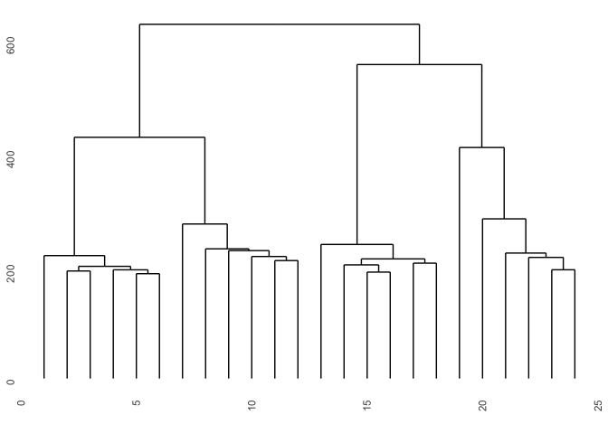
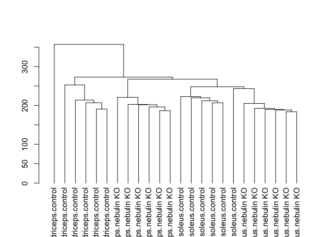
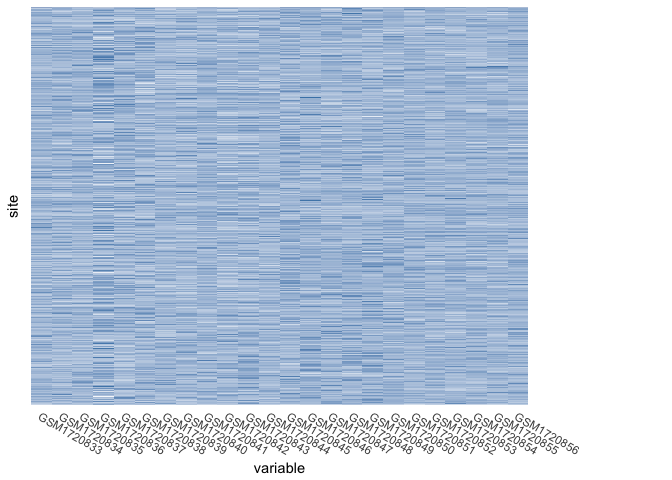
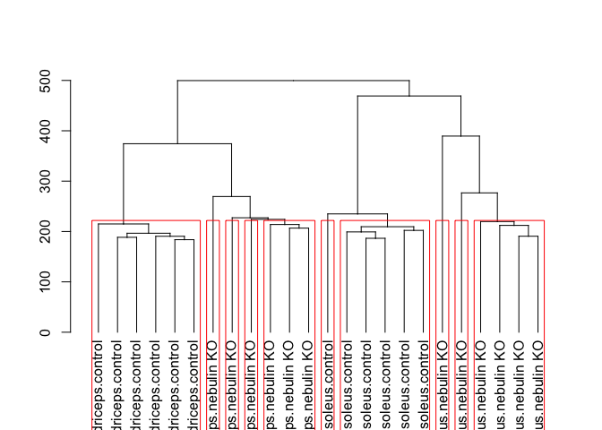
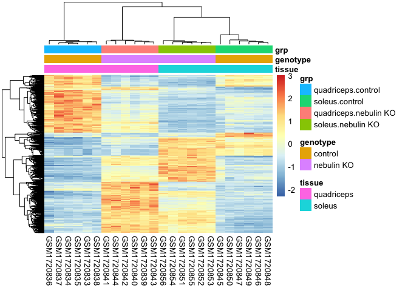
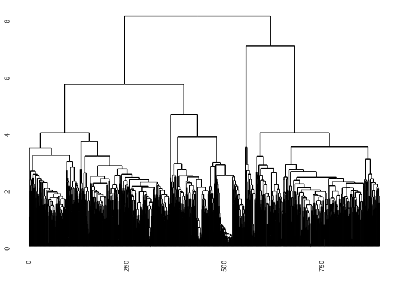
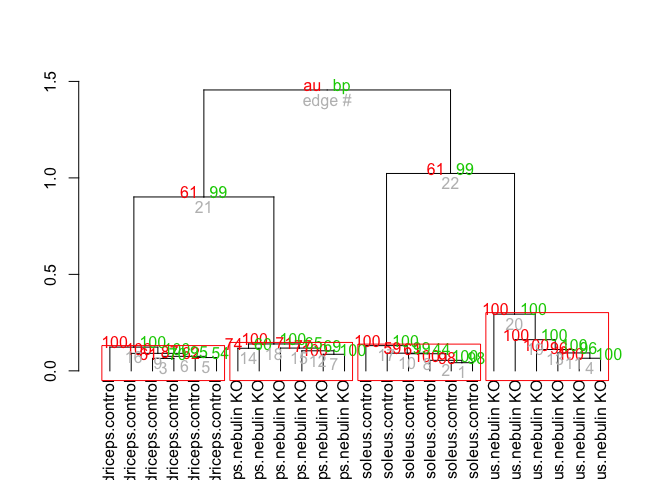

Seminar06
================
Abdullah Farouk
2018-02-14

R Markdown
----------

``` r
#Load packages

library(RColorBrewer)
library(cluster)
library(pvclust)
library(xtable)
library(limma)
library(plyr)
library(lattice)
library(RCurl)
```

    ## Loading required package: bitops

``` r
options('download.file.method'='curl')
library(GEOquery)
```

    ## Loading required package: Biobase

    ## Loading required package: BiocGenerics

    ## Loading required package: parallel

    ## 
    ## Attaching package: 'BiocGenerics'

    ## The following objects are masked from 'package:parallel':
    ## 
    ##     clusterApply, clusterApplyLB, clusterCall, clusterEvalQ,
    ##     clusterExport, clusterMap, parApply, parCapply, parLapply,
    ##     parLapplyLB, parRapply, parSapply, parSapplyLB

    ## The following object is masked from 'package:limma':
    ## 
    ##     plotMA

    ## The following objects are masked from 'package:stats':
    ## 
    ##     IQR, mad, xtabs

    ## The following objects are masked from 'package:base':
    ## 
    ##     anyDuplicated, append, as.data.frame, cbind, colnames,
    ##     do.call, duplicated, eval, evalq, Filter, Find, get, grep,
    ##     grepl, intersect, is.unsorted, lapply, lengths, Map, mapply,
    ##     match, mget, order, paste, pmax, pmax.int, pmin, pmin.int,
    ##     Position, rank, rbind, Reduce, rownames, sapply, setdiff,
    ##     sort, table, tapply, union, unique, unsplit, which, which.max,
    ##     which.min

    ## Welcome to Bioconductor
    ## 
    ##     Vignettes contain introductory material; view with
    ##     'browseVignettes()'. To cite Bioconductor, see
    ##     'citation("Biobase")', and for packages 'citation("pkgname")'.

    ## Setting options('download.file.method.GEOquery'='auto')

    ## Setting options('GEOquery.inmemory.gpl'=FALSE)

``` r
library(knitr)
library(pheatmap)
library(ggdendro)
```

    ## 
    ## Attaching package: 'ggdendro'

    ## The following object is masked from 'package:xtable':
    ## 
    ##     label

``` r
library(tidyr)
```

    ## 
    ## Attaching package: 'tidyr'

    ## The following object is masked from 'package:RCurl':
    ## 
    ##     complete

``` r
library(tidyverse)
```

    ## Loading tidyverse: ggplot2
    ## Loading tidyverse: tibble
    ## Loading tidyverse: readr
    ## Loading tidyverse: purrr
    ## Loading tidyverse: dplyr

    ## Conflicts with tidy packages ----------------------------------------------

    ## arrange():   dplyr, plyr
    ## combine():   dplyr, Biobase, BiocGenerics
    ## compact():   purrr, plyr
    ## complete():  tidyr, RCurl
    ## count():     dplyr, plyr
    ## failwith():  dplyr, plyr
    ## filter():    dplyr, stats
    ## id():        dplyr, plyr
    ## lag():       dplyr, stats
    ## mutate():    dplyr, plyr
    ## Position():  ggplot2, BiocGenerics, base
    ## rename():    dplyr, plyr
    ## summarise(): dplyr, plyr
    ## summarize(): dplyr, plyr

``` r
library(ggplot2)
library("grid")
library(dendextend)
```

    ## 
    ## ---------------------
    ## Welcome to dendextend version 1.7.0
    ## Type citation('dendextend') for how to cite the package.
    ## 
    ## Type browseVignettes(package = 'dendextend') for the package vignette.
    ## The github page is: https://github.com/talgalili/dendextend/
    ## 
    ## Suggestions and bug-reports can be submitted at: https://github.com/talgalili/dendextend/issues
    ## Or contact: <tal.galili@gmail.com>
    ## 
    ##  To suppress this message use:  suppressPackageStartupMessages(library(dendextend))
    ## ---------------------

    ## 
    ## Attaching package: 'dendextend'

    ## The following object is masked from 'package:ggdendro':
    ## 
    ##     theme_dendro

    ## The following object is masked from 'package:stats':
    ## 
    ##     cutree

``` r
library(plotly)
```

    ## 
    ## Attaching package: 'plotly'

    ## The following object is masked from 'package:ggplot2':
    ## 
    ##     last_plot

    ## The following objects are masked from 'package:plyr':
    ## 
    ##     arrange, mutate, rename, summarise

    ## The following object is masked from 'package:stats':
    ## 
    ##     filter

    ## The following object is masked from 'package:graphics':
    ## 
    ##     layout

Read the data into R

``` r
options('download.file.method'='curl')
if(file.exists("GSE70213.Rdata")){ # if previously downloaded
  load("GSE70213.Rdata")
} else { 
#Get geo object that contains our data and phenotype information  
geo_obj <- getGEO("GSE70213", GSEMatrix = TRUE)
geo_obj <- geo_obj[[1]]
save(geo_obj, file = "GSE70213.Rdata")
}
#Get expression data  
data <- exprs(geo_obj)

#Get covariate data  
prDes <- pData(geo_obj)[,c("organism_ch1","title",colnames(pData(geo_obj))[grep("characteristics", colnames(pData(geo_obj)))])]

##Clean up covariate data  
colnames(prDes) = c("organism","sample_name","tissue","genotype","sex","age")
prDes$tissue = as.factor(gsub("tissue: ","", prDes$tissue))
prDes$genotype = as.factor(gsub("genotype: ","", prDes$genotype))
prDes$sex = as.factor(gsub("Sex: ","", prDes$sex))
prDes$age = gsub("age: ","", prDes$age)
```

Clustering

``` r
#Heirarchical Clustering

#Round data
sprDat <- t(scale(t(data)))
data_to_plot_0 <- sprDat
data_to_plot <- as.data.frame(sprDat)
data_to_plot$site <- rownames(sprDat) #Add gene site information
data_to_plot_1 <- gather(data_to_plot, key = variable, value = expression, -site) #Long format

# compute pairwise distances
pr.dis <- dist(t(data_to_plot_0), method = "euclidean")

# create a new factor representing the interaction of tissue type and genotype
prDes$grp <- with(prDes, interaction(tissue, genotype))

#Initial Plots
pr.hc.s <- hclust(pr.dis, method = "single")
pr.hc.c <- hclust(pr.dis, method = "complete")
pr.hc.a <- hclust(pr.dis, method = "average")
pr.hc.w <- hclust(pr.dis, method = "ward.D")

# plot them
{ggdendrogram(pr.hc.s, labels = FALSE, main = "Single", xlab = "")
ggdendrogram(pr.hc.c, labels = FALSE, main = "Complete", xlab = "")
ggdendrogram(pr.hc.a, labels = FALSE, main = "Average", xlab = "")
ggdendrogram(pr.hc.w, labels = FALSE, main = "Ward", xlab = "")}
```



``` r
#Using ggplot to create Dendograms and heatmaps
pr.hc.s <- as.dendrogram(hclust(pr.dis, method = "average"))
k_3 <- cutree(pr.hc.s, k = 24, order_clusters_as_data = FALSE) 
# The FALSE above makes sure we get the clusters in the order of the dendrogram
the_bars <- cbind(prDes$grp, k_3)
dendro.plot <- pr.hc.s %>% set("labels", prDes$grp)
{dendro.plot %>% plot
  colored_bars(colors = the_bars, dend = pr.hc.s)}  
```



``` r
#Plot a heatmap of the dendogram
heatmap.plot <- ggplot(data_to_plot_1, aes(variable, site)) + 
  geom_tile(aes(fill = expression)) + #specify quantitative variable to fill over
  scale_fill_gradient(low = "white", high = "steelblue") +
  theme(legend.position = "none",
        axis.ticks = element_blank(), 
        axis.text.x = element_text(angle = 330, hjust = 0), axis.text.y = element_blank())

# All together
{grid.newpage()
print(heatmap.plot, vp = viewport(x = 0.4, y = 0.5, width = 0.8, height = 1.0))
print(dendro.plot, vp = viewport(x = 0.90, y = 0.43, width = 0.2, height = 0.92))}
```



    ## 'dendrogram' with 2 branches and 24 members total, at height 357.0743

``` r
#Plot dendogram of 10 genes
# identify 10 clusters
pr.hc.w <- as.dendrogram(hclust(pr.dis, method = "ward.D2"))
{pr.hc.w  %>% set("labels", prDes$grp) %>% plot
pr.hc.w %>% rect.dendrogram(k = 10)}
```



Agglomerative Hierarchical Clustering of Top Genes

``` r
cutoff <- 1e-05
DesMat <- model.matrix(~grp, prDes)
dsFit <- lmFit(sprDat, DesMat)
dsEbFit <- eBayes(dsFit)
dsHits <- topTable(dsEbFit, coef = grep("grp", colnames(coef(dsEbFit))), p.value = cutoff, 
    n = Inf)
numBHhits <- nrow(dsHits)

topGenes <- rownames(dsHits)

# Scaled data of topGenes
topDat <- sprDat[topGenes, ]

#Heatmap
pheatmap(topDat, cluster_rows = TRUE, scale = "none", clustering_method = "mcquitty", 
    clustering_distance_cols = "correlation", clustering_distance_rows = "euclidean", 
    annotation = prDes[, c("tissue", "genotype", "grp")], show_rownames = FALSE)
```



``` r
geneC.dis <- dist(topDat, method = "euclidean")

geneC.hc.a <- hclust(geneC.dis, method = "average")

ggdendrogram(geneC.hc.a, labels = FALSE, main = "Hierarchical with Average Linkage", xlab = "")
```



``` r
#Using pvclust on the top 100 genes
pvc <- pvclust(topDat, nboot = 100)
```

    ## Bootstrap (r = 0.5)... Done.
    ## Bootstrap (r = 0.6)... Done.
    ## Bootstrap (r = 0.7)... Done.
    ## Bootstrap (r = 0.8)... Done.
    ## Bootstrap (r = 0.9)... Done.
    ## Bootstrap (r = 1.0)... Done.
    ## Bootstrap (r = 1.1)... Done.
    ## Bootstrap (r = 1.2)... Done.
    ## Bootstrap (r = 1.3)... Done.
    ## Bootstrap (r = 1.4)... Done.

``` r
#Try plotting
{pvc %>% as.dendrogram %>% 
  set("labels", prDes$grp) %>%
  plot
pvc %>% text
pvc %>% pvrect}
```


