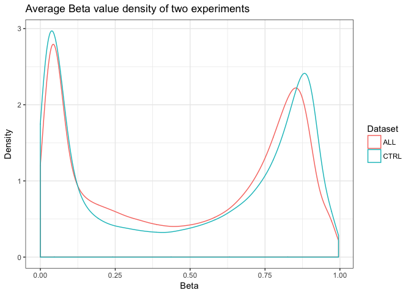
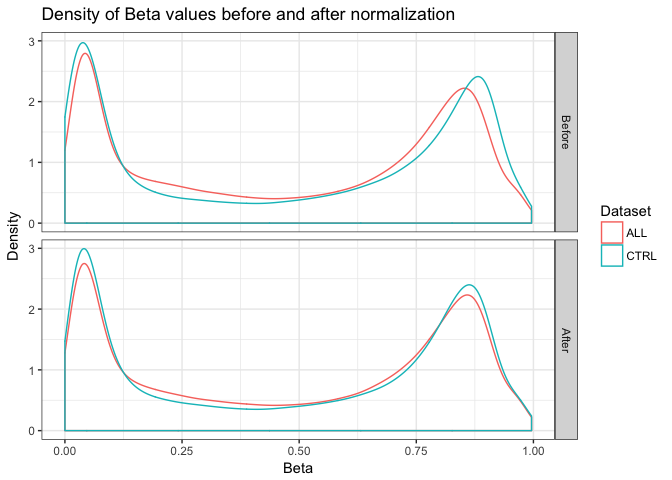
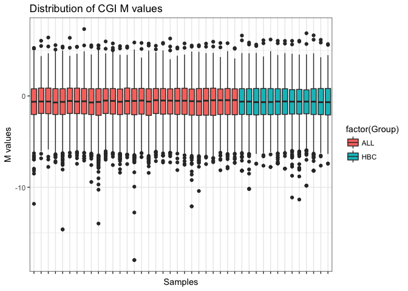
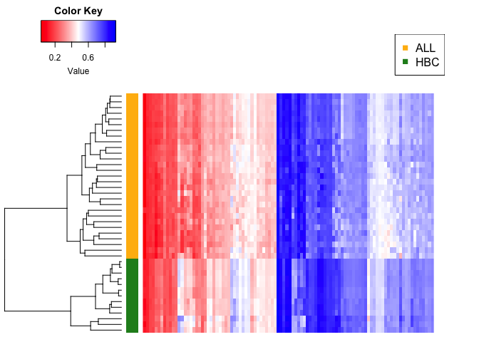
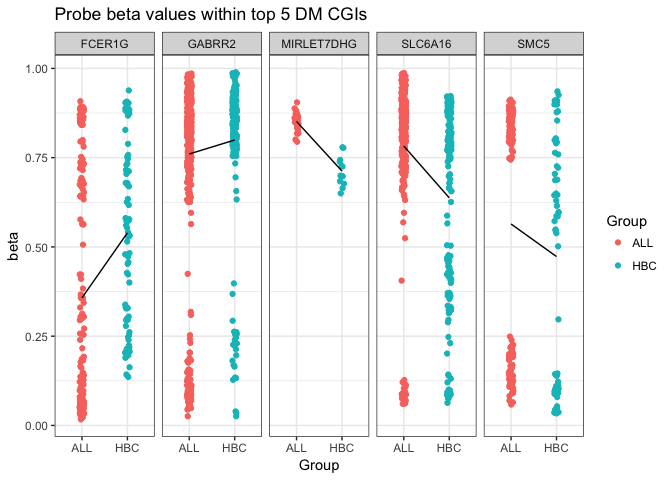
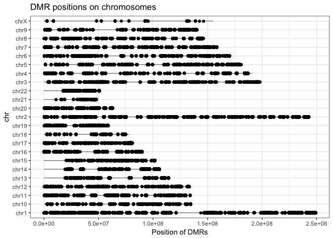

Seminar 7
================
Abdullah Farouk
2018-03-03

``` r
# source('http://bioconductor.org/biocLite.R')
# biocLite('GEOquery')
# biocLite('wateRmelon')
# biocLite("IlluminaHumanMethylation450k.db")
# biocLite("FDb.InfiniumMethylation.hg19")
library(GEOquery)
library(wateRmelon)
library(FDb.InfiniumMethylation.hg19)
```

``` r
load("/Users/abdullah/Downloads/methyl_ALL.Rdata")

 # save the data to avoid future re-downloading
 # save(ALL.dat, CTRL.dat, ALL.meta, CTRL.meta, file = "methyl_ALL.Rdata")

# density plot
library(ggplot2)
dat.probeMeans <- c(rowMeans(ALL.dat, na.rm = T), rowMeans(CTRL.dat, na.rm = T)) 
plotDat <- data.frame(Beta = dat.probeMeans,
                      Dataset = rep(c('ALL', 'CTRL'), each = nrow(ALL.dat)))
(probeAvg <- ggplot(data = plotDat, aes(x = Beta, col = Dataset)) +
   geom_density() + 
   ggtitle("Average Beta value density of two experiments") + 
   xlab("Beta") + 
   ylab("Density") + 
   theme_bw()
)
```



``` r
# combine data from two experiments into one matrix, each column represents beta
# values of one sample
beta.matrix <- as.matrix(cbind(ALL.dat, CTRL.dat))
str(beta.matrix, max.level = 0)
```

    ##  num [1:485577, 1:42] 0.512 0.911 0.857 0.149 0.729 ...
    ##  - attr(*, "dimnames")=List of 2

``` r
# quantile normalization
system.time(beta.norm <- betaqn(beta.matrix))
```

    ##    user  system elapsed 
    ##  28.579   2.449  31.138

``` r
dat.probeMeans <- c(rowMeans(beta.norm[, 1:ncol(ALL.dat)], na.rm = TRUE),
                    rowMeans(beta.norm[, ncol(ALL.dat):ncol(beta.norm)], na.rm = TRUE)) 
plotNorm <-
  rbind(data.frame(plotDat, Norm = "Before"),
        data.frame(Beta = dat.probeMeans,
                   Dataset = rep(c('ALL', 'CTRL'), each = nrow(ALL.dat)),
                   Norm = "After"))
plotNorm$Norm <- factor(plotNorm$Norm, levels = c("Before", "After"))
(probeAvgNorm <- ggplot(data = plotNorm, aes(x = Beta, col = Dataset)) +
   geom_density() + 
   facet_grid(Norm ~ .) + 
   ggtitle("Density of Beta values before and after normalization") + 
   xlab("Beta") + 
   ylab("Density") + 
   theme_bw()
)
```



``` r
#M Values
M.norm <- beta2m(beta.norm)

#First get annotation data from FDb database  
InfiniumMethylation <- features(FDb.InfiniumMethylation.hg19)

## We only want annotations for the hg19 genome  
met <- metadata(FDb.InfiniumMethylation.hg19) ## need to fetch genome
genome(InfiniumMethylation) <- met[which(met[,'name']=='Genome'),'value']

InfiniumMethylation <- sort(InfiniumMethylation)
show(InfiniumMethylation)
```

    ## GRanges object with 487173 ranges and 14 metadata columns:
    ##              seqnames               ranges strand | addressA_450
    ##                 <Rle>            <IRanges>  <Rle> |  <character>
    ##   cg01686861    chr16       [60748, 60749]      + |     36644319
    ##   cg05558259    chr16       [61085, 61086]      + |     65765435
    ##   cg26978960    chr16       [62460, 62461]      + |     28717484
    ##   cg03792876    chr16       [73243, 73244]      + |     42725455
    ##   cg09699726    chr16       [91602, 91603]      + |     34629364
    ##          ...      ...                  ...    ... .          ...
    ##   cg13808036     chrY [24453658, 24453659]      - |     47649309
    ##   cg26983430     chrY [24549675, 24549676]      - |     24631411
    ##   cg17939569     chrY [27009430, 27009431]      - |     73757458
    ##   cg13365400     chrY [27210334, 27210335]      - |     61745505
    ##   cg14273923     chrY [28555912, 28555913]      - |     16749405
    ##              addressB_450 addressA_27 addressB_27  channel450   channel27
    ##               <character> <character> <character> <character> <character>
    ##   cg01686861     45624454        <NA>        <NA>         Red        <NA>
    ##   cg05558259                     <NA>        <NA>        Both        <NA>
    ##   cg26978960                     <NA>        <NA>        Both        <NA>
    ##   cg03792876                     <NA>        <NA>        Both        <NA>
    ##   cg09699726                     <NA>        <NA>        Both        <NA>
    ##          ...          ...         ...         ...         ...         ...
    ##   cg13808036                     <NA>        <NA>        Both        <NA>
    ##   cg26983430     26605360        <NA>        <NA>         Red        <NA>
    ##   cg17939569                     <NA>        <NA>        Both        <NA>
    ##   cg13365400                     <NA>        <NA>        Both        <NA>
    ##   cg14273923                     <NA>        <NA>        Both        <NA>
    ##                probeType   percentGC    platform
    ##              <character> <character> <character>
    ##   cg01686861          cg        0.76       HM450
    ##   cg05558259          cg        0.56       HM450
    ##   cg26978960          cg        0.66       HM450
    ##   cg03792876          cg        0.64       HM450
    ##   cg09699726          cg        0.68       HM450
    ##          ...         ...         ...         ...
    ##   cg13808036          cg        0.64       HM450
    ##   cg26983430          cg        0.56       HM450
    ##   cg17939569          cg        0.42       HM450
    ##   cg13365400          cg        0.44       HM450
    ##   cg14273923          cg        0.48       HM450
    ##                                                       sourceSeq
    ##                                                     <character>
    ##   cg01686861 CGCCCCCAGGCCGGCGCCGTGCGACTTTGCTCCTGCAACACACGCCCCCC
    ##   cg05558259 CAGCTAGGGACATTGCAGGCTCCTCTTGCTCAAAGTGTAGTGGCAGCACG
    ##   cg26978960 CGGCCCAGTAGAGCCCTAGGGGTGACGCCACTCCCACTCACTGTCGACTC
    ##   cg03792876 ATGGAGGCTTGGGCGGGTCACCCCCAGTGCAGGCCAAGATGCAGGTTACG
    ##   cg09699726 GCACTAGAGCCCCAGGGCCAGGGGAGACCCAGCATCCAAGGTGCACCACG
    ##          ...                                                ...
    ##   cg13808036 CGGCGCCCACCCACTGCTGCCAGCCATCCCGAATTGACAGCTGCAAGGAT
    ##   cg26983430 CGTACGCCTGAGGGCCAGGCGAACCTCAGGCTCTTTGTCCTACTAAAAAG
    ##   cg17939569 CGCCTAAATAAGAATAGGAGTAAAGGAGAGTATTACCTCCAAATCACCGG
    ##   cg13365400 CGTCACCTGGATGCTGGTTTAAGTGATATATGAAAATCCACCCTAAGGAC
    ##   cg14273923 TGGTATTGGTGAAGTCTACCACTCCAGCTCGTAGACTTCCATAATCGTCG
    ##               probeStart    probeEnd probeTarget probeExtension
    ##              <character> <character> <character>    <character>
    ##   cg01686861       60700       60749       60748        60749.0
    ##   cg05558259       61037       61086       61085        61086.0
    ##   cg26978960       62412       62461       62460        62461.0
    ##   cg03792876       73195       73244       73243        73244.0
    ##   cg09699726       91554       91603       91602        91603.0
    ##          ...         ...         ...         ...            ...
    ##   cg13808036    24453658    24453707    24453658           <NA>
    ##   cg26983430    24549675    24549724    24549675           <NA>
    ##   cg17939569    27009430    27009479    27009430           <NA>
    ##   cg13365400    27210334    27210383    27210334           <NA>
    ##   cg14273923    28555912    28555961    28555912           <NA>
    ##   -------
    ##   seqinfo: 24 sequences from hg19 genome; no seqlengths

``` r
## Subset to probes that are present in 450k assay  
probes_450k = as.data.frame(InfiniumMethylation[InfiniumMethylation$platform %in% c("BOTH","HM450"),])
probes_450k$Probe_ID = rownames(probes_450k)
cginame_onlycg = probes_450k[probes_450k$probeType == "cg", ]

hm450 <-  getPlatform(platform='HM450', genome='hg19')
```

    ## Fetching coordinates for hg19...

``` r
probe_UCSC_name = getNearestGene(hm450)

#Restrict our own dataset to probes within CGIs  
beta.inCGI <- beta.norm[rownames(beta.norm) %in% rownames(probe_UCSC_name),]
M.inCGI <- M.norm[rownames(M.norm) %in% rownames(probe_UCSC_name),]
cginame = probe_UCSC_name[rownames(M.inCGI),]
cginame$cginame = cginame$nearestGeneSymbol
cginame$Probe_ID = rownames(cginame)
nrow(M.inCGI)
```

    ## [1] 485577

``` r
## What is the cginame characteristic in the updated data source?? 
# aggregate probes to CGIs
beta.CGI <- aggregate(beta.inCGI, by = list(cginame$nearestGeneSymbol), mean, na.rm = T)
rownames(beta.CGI) <- beta.CGI[, "Group.1"]
beta.CGI <- subset(beta.CGI, select = - Group.1)
str(beta.CGI, max.level = 0)
```

    ## 'data.frame':    20411 obs. of  42 variables:

``` r
M.CGI <- aggregate(M.inCGI, by = list(cginame$nearestGeneSymbol), mean, na.rm = T)
rownames(M.CGI) <- M.CGI[, "Group.1"]
M.CGI <- subset(M.CGI, select = - Group.1)
str(M.CGI, max.level = 0)
```

    ## 'data.frame':    20411 obs. of  42 variables:

``` r
# check the distribution of CGI M values with boxplot
library(reshape2)
M.CGI.tall <- melt(t(M.CGI), value.name = 'M', varnames = c('Sample', 'CGI'))
M.CGI.tall$Group <- gsub("_[0-9]+", "", M.CGI.tall$Sample)
(M.boxplot <- ggplot(data = M.CGI.tall, aes(Sample, M, fill = factor(Group))) + 
   geom_boxplot() + 
   ggtitle("Distribution of CGI M values") + 
   xlab("Samples") + 
   ylab("M values") + 
   theme_bw() + 
   scale_x_discrete(labels = NULL))
```

    ## Warning: Removed 17444 rows containing non-finite values (stat_boxplot).



``` r
library(limma)
design <-
  data.frame(Group = relevel(factor(gsub("_[0-9]+", "", colnames(M.CGI))),
                             ref = "HBC"), row.names = colnames(M.CGI))
str(design)
```

    ## 'data.frame':    42 obs. of  1 variable:
    ##  $ Group: Factor w/ 2 levels "HBC","ALL": 2 2 2 2 2 2 2 2 2 2 ...

``` r
(DesMat <- model.matrix(~ Group, design))
```

    ##             (Intercept) GroupALL
    ## ALL_956761            1        1
    ## ALL_956762            1        1
    ## ALL_956763            1        1
    ## ALL_956764            1        1
    ## ALL_956765            1        1
    ## ALL_956766            1        1
    ## ALL_956767            1        1
    ## ALL_956768            1        1
    ## ALL_956769            1        1
    ## ALL_956770            1        1
    ## ALL_956771            1        1
    ## ALL_956772            1        1
    ## ALL_956773            1        1
    ## ALL_956774            1        1
    ## ALL_956775            1        1
    ## ALL_956776            1        1
    ## ALL_956777            1        1
    ## ALL_956778            1        1
    ## ALL_956779            1        1
    ## ALL_956780            1        1
    ## ALL_956781            1        1
    ## ALL_956782            1        1
    ## ALL_956783            1        1
    ## ALL_956784            1        1
    ## ALL_956785            1        1
    ## ALL_956786            1        1
    ## ALL_956787            1        1
    ## ALL_956788            1        1
    ## ALL_956789            1        1
    ## HBC_956790            1        0
    ## HBC_956791            1        0
    ## HBC_956792            1        0
    ## HBC_956793            1        0
    ## HBC_1052420           1        0
    ## HBC_1052421           1        0
    ## HBC_1052422           1        0
    ## HBC_1052423           1        0
    ## HBC_1052424           1        0
    ## HBC_1052425           1        0
    ## HBC_1052426           1        0
    ## HBC_1052427           1        0
    ## HBC_1052428           1        0
    ## attr(,"assign")
    ## [1] 0 1
    ## attr(,"contrasts")
    ## attr(,"contrasts")$Group
    ## [1] "contr.treatment"

``` r
DMRfit <- lmFit(M.CGI, DesMat)
DMRfitEb <- eBayes(DMRfit)
cutoff <- 0.01
DMR <- topTable(DMRfitEb, coef = 'GroupALL', number = Inf, p.value = cutoff)
head(DMR)   # top hits 
```

    ##                 logFC    AveExpr         t      P.Value    adj.P.Val
    ## MIRLET7DHG  1.2189997  2.1623616  12.65490 4.802846e-16 9.803090e-12
    ## SLC6A16     1.1853858  1.8099160  11.56515 9.611071e-15 9.808578e-11
    ## SMC5        0.8456980  0.1723806  11.14727 3.157479e-14 2.148243e-10
    ## GABRR2     -0.4506881  2.1276014 -10.91057 6.255943e-14 3.192251e-10
    ## FCER1G     -1.7373139 -0.8682490 -10.55357 1.778827e-13 7.261529e-10
    ## C4orf26     1.0424391  1.8333076  10.45000 2.416227e-13 8.219603e-10
    ##                   B
    ## MIRLET7DHG 25.99535
    ## SLC6A16    23.18428
    ## SMC5       22.06121
    ## GABRR2     21.41393
    ## FCER1G     20.42245
    ## C4orf26    20.13140

``` r
library(gplots)
```

    ## 
    ## Attaching package: 'gplots'

    ## The following object is masked from 'package:IRanges':
    ## 
    ##     space

    ## The following object is masked from 'package:S4Vectors':
    ## 
    ##     space

    ## The following object is masked from 'package:stats':
    ## 
    ##     lowess

``` r
DMR100 <- topTable(DMRfitEb, coef = 'GroupALL', number = 100)
DMR.CGI <- t(as.matrix(subset(beta.CGI,
                              rownames(beta.CGI) %in% rownames(DMR100))))
str(DMR.CGI, max.level = 0)
```

    ##  num [1:42, 1:100] 0.706 0.712 0.677 0.673 0.673 ...
    ##  - attr(*, "dimnames")=List of 2

``` r
col <- c(rep("darkgoldenrod1", times = nrow(DMR.CGI))) 
col[grepl("HBC", rownames(DMR.CGI))] <- "forestgreen"
op <- par(mai = rep(0.5, 4))
heatmap.2(DMR.CGI, col = redblue(256), RowSideColors = col,
          density.info = "none", trace = "none", Rowv = TRUE, Colv = TRUE,
          labCol = FALSE, labRow = FALSE, dendrogram="row",
          margins = c(1, 5))
legend("topright", c("ALL", "HBC"),
       col = c("darkgoldenrod1", "forestgreen"), pch = 15)
```



``` r
DMR5 <- topTable(DMRfitEb, coef = 'GroupALL', number = 5)
beta.DMR5probe <-
  beta.inCGI[cginame[rownames(beta.inCGI),]$cginame %in% rownames(DMR5),]
beta.DMR5probe.tall <-
  melt(beta.DMR5probe, value.name = 'M', varnames = c('Probe_ID', 'Sample'))
beta.DMR5probe.tall$Group <-
  factor(gsub("_[0-9]+", "", beta.DMR5probe.tall$Sample))
beta.DMR5probe.tall$CGI <-
  factor(cginame[as.character(beta.DMR5probe.tall$Probe_ID),]$cginame)
(beta.DMR5.stripplot <-
   ggplot(data = beta.DMR5probe.tall, aes(x = Group, y = M, color = Group)) + 
   geom_point(position = position_jitter(width = 0.05), na.rm = T) + 
   stat_summary(fun.y = mean, aes(group = 1), geom = "line", color = "black") + 
   facet_grid(. ~ CGI) + 
   ggtitle("Probe beta values within top 5 DM CGIs") + 
   xlab("Group") + 
   ylab("beta") + 
   theme_bw())
```

    ## Warning: Removed 1 rows containing non-finite values (stat_summary).



``` r
chrlen = as.data.frame(seqinfo.hg19)
chrlen$chr = as.character(rownames(chrlen))
chrlen = chrlen[chrlen$chr %in% c("chrX",paste("chr",1:22,sep="")),]
chr <- probes_450k[,c("seqnames","start","Probe_ID")]; colnames(chr) = c("chr","coord","Probe_ID")
coord_big = merge(chr, chrlen, by="chr"); rownames(coord_big) = coord_big$Probe_ID
coord = coord_big[,c("chr","coord")]
# coordinates of probes in DM CGIs
coordDMRprobe <- droplevels(na.omit(coord[cginame[cginame$cginame %in% rownames(DMR),]$Probe_ID,])) 
coordDMRprobe$chr <- as.character(coordDMRprobe$chr)
(coord.plot <- ggplot(data = coordDMRprobe) + 
   geom_linerange(aes(x=chr, ymin = 0, ymax = seqlengths), data = chrlen, alpha = 0.5) + 
   geom_point(aes(x = chr, y = coord),
              position = position_jitter(width = 0.03), na.rm = T) + 
   ggtitle("DMR positions on chromosomes") + 
   ylab("Position of DMRs") +
   xlab("chr") +
   coord_flip() + 
   theme_bw())
```



Linear Model Assumptions Violated
---------------------------------

-   Imperfect conversion of beta values into a continous variable. Further this variable is bounded between 0 and 1 where as in a linear model it is bounded between negative and positive infinity.

-   Pooling of the M values. Could lead to over/underestimation of standard deviations of methylation sites. This would result in incorrect p values and there false significant differences.

- Two peaks in the density plot of Beta values representing methylation sites. Contradicts the assumption of normaly distributed errors in a linear model as the dependent variable, which is a function of the errors does not seem to be normally distributed.
